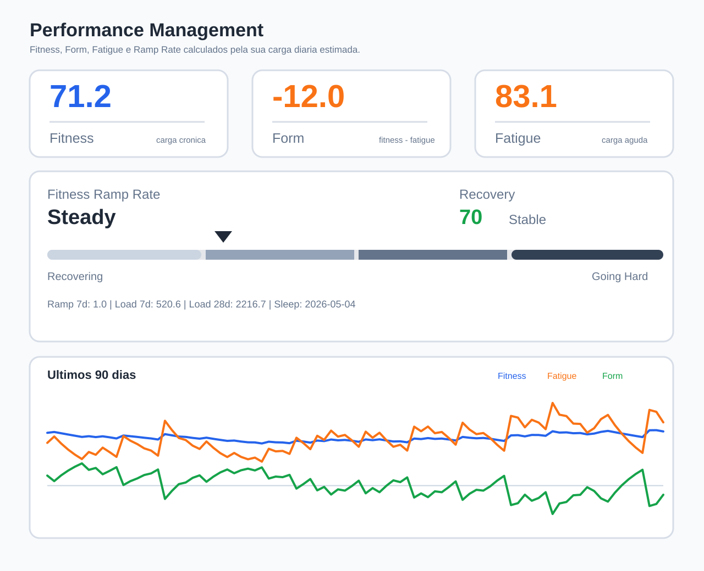
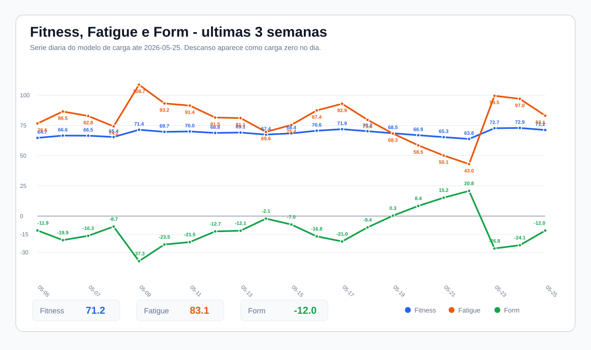
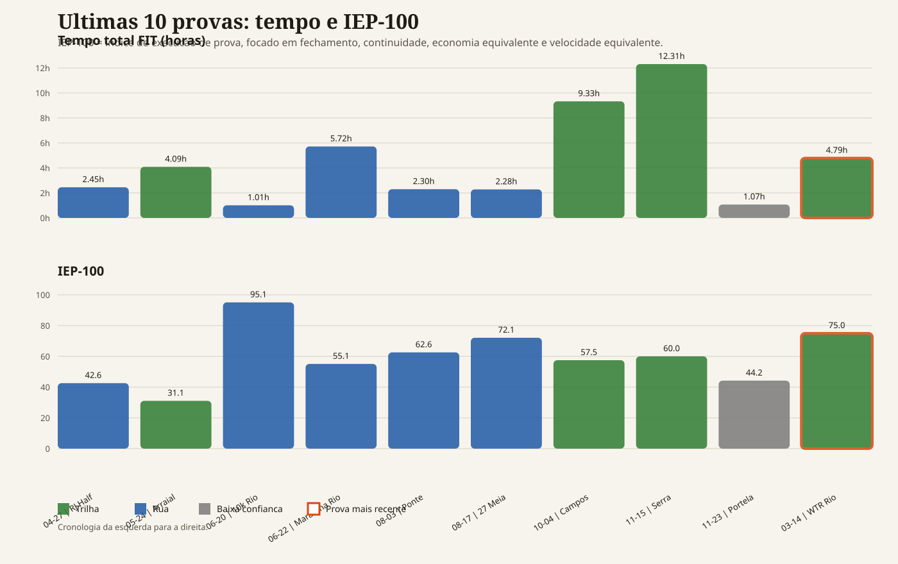

# Mountain Endurance Performance Agent


Personal performance analytics system for trail running, endurance training, and high-altitude mountaineering.

Suggested GitHub description: `Mountain-endurance analytics agent for trail running, GPX/FIT parsing, training-load modeling, and public performance dashboards.`

## Why This Exists

This project turns raw endurance data into a coach-like analytical context. It was built around a real 2026 objective: an Andean expedition in Arequipa, where the priority is not pace, but durability, vertical efficiency, fatigue control, and the ability to keep moving for a long time.

The goal is to combine:

- Sports memory: athlete profile, training history, race history, body metrics, mountain history, and season goals.
- Data analysis: GPX/FIT parsing, Garmin CSV imports, elevation metrics, heart-rate patterns, load modeling, and trend charts.
- Coaching interpretation: practical answers about pacing, fatigue, mountain readiness, and whether a workout helps the main objective.

This repository is intentionally portfolio-friendly: it can show the analytical engine and generated dashboards publicly while keeping raw personal health exports private.

## Example Dashboards

### Performance Management Model



### Fitness, Fatigue, and Form - Last 3 Weeks



### Race Performance Index



## What The Agent Analyzes

- Trail and road races used as endurance training blocks.
- Long runs, vertical sessions, swims, strength workouts, hikes, and stair sessions.
- Official GPX files, prioritizing route elevation over watch elevation when available.
- Garmin activity CSV exports, workout CSV exports, sleep CSV exports, and FIT files.
- Subjective context such as training intent, fatigue perception, and race strategy.

## Core Metrics

- `vertical_per_km = elevation_gain_m / distance_km`
- `vertical_speed = elevation_gain_m / duration_hours`
- `vertical_speed_moving = elevation_gain_m / moving_time_hours`
- `stopped_time = elapsed_time - moving_time`
- `mountain_index = distance_km + elevation_gain_m / 100`
- `heart_rate_efficiency = pace_seconds_per_km / avg_hr`
- `fitness`: chronic load estimate, smoothed over 42 days.
- `fatigue`: acute load estimate, smoothed over 7 days.
- `form`: readiness estimate, calculated as `fitness - fatigue`.

The performance-management model is inspired by training-load concepts, but it is not the proprietary TrainingPeaks algorithm. It is a custom model tuned for this athlete-agent use case.

## Project Structure

```text
athlete-agent/
  activities/        Raw local inputs: GPX, FIT, Garmin CSV, notes.
  analysis/          Generated reports, dashboards, and chart outputs.
  data/              Athlete memory and private analytical state.
  docs/              Public documentation for metrics, privacy, and usage.
  prompts/           System prompt for the coaching analyst agent.
  scripts/           Importers, parsers, comparison tools, and chart builders.
```

## Public vs Private Data

Raw Garmin/Strava exports, FIT files, GPX files, PDFs, and athlete JSON databases can contain sensitive health and location data. The `.gitignore` is configured so those files stay local by default.

Recommended public assets:

- Source code in `scripts/`.
- Documentation in `docs/`.
- Sanitized sample JSON files.
- Generated SVG dashboards that are safe to show as portfolio examples.

Recommended private assets:

- Raw activity exports.
- Sleep exports.
- Ergometric or cardiopulmonary PDFs.
- Full athlete history JSON files.
- Location-rich GPX/FIT files.

## Quick Start

Install optional dependencies:

```bash
python -m pip install -r requirements.txt
```

Parse an official GPX route:

```bash
python scripts/parse_gpx.py activities/gpx/example.gpx --category race
```

Build the performance-management model:

```bash
python scripts/build_performance_management_model.py
python scripts/build_last_3_weeks_pmc_chart.py
```

Import recent Garmin files from a custom folder:

```bash
ATHLETE_AGENT_DOWNLOADS=/path/to/exports python scripts/import_garmin_recent_data.py
```

On Windows PowerShell:

```powershell
$env:ATHLETE_AGENT_DOWNLOADS = "C:\Users\your-user\Downloads"
python scripts/import_garmin_recent_data.py
```

## Coaching Output Format

The agent should answer with:

1. Activity summary.
2. Physiological reading.
3. Terrain reading.
4. Comparison with history.
5. Impact on the season goal.
6. Practical recommendation.

The operating principle is simple: races are treated as training opportunities for the main mountain objective. Completion, endurance, and recovery quality matter more than chasing pace unless the athlete explicitly changes that goal.

## Portfolio Angle

This project demonstrates:

- Python data pipelines over messy real-world sports exports.
- Domain modeling for endurance and mountain performance.
- Custom load modeling and trend visualization.
- Privacy-aware public presentation of personal analytics.
- Agent-oriented context design for coaching-style reasoning.
