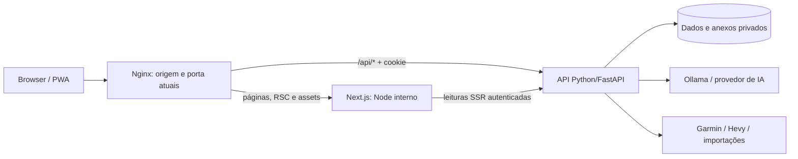

# Plano e resultado da migração da UI do AscentIQ

Data de início e atualização: 08/10/2026. **Status: migração implementada, promovida para `dashboard/web`, publicada na origem atual e validada operacionalmente em desktop/mobile e PWA.** As correções finais de retorno seguro após login e de aviso de conflito no assistente foram testadas e republicadas. HTTPS confiável para instalação mobile pela LAN permanece uma dependência externa à troca de UI.

Objetivo realizado: substituir integralmente a interface React/Vite/CSS anterior por React + Next.js App Router + TypeScript + Tailwind CSS + shadcn/ui, preservando as funcionalidades, os dados, as integrações e a composição visual aprovada.

Este documento conserva os requisitos do plano e registra as decisões efetivamente implementadas, as validações realizadas e o trabalho restante. A interface antiga deixou de ser a fonte oficial do frontend no repositório. Frontend/gateway estão saudáveis; leituras reais, navegador desktop/mobile e ciclo público da PWA foram conferidos. O resultado é limitado aos cenários registrados: não equivale a executar todos os fornecedores externos nem a validar instalação mobile via HTTP na LAN.

Resultado confirmado: App Router com as sete rotas previstas, componentes shadcn/Radix, tema Tailwind, domínio separado por features, infraestrutura TypeScript estrita, contratos API preservados e Docker com frontend Node e gateway Nginx. Passaram lint, types, proibição de estilos, builds finais de produção em Windows e Linux, **17 testes unitários em 6 arquivos** (11 de domínio + 6 de retorno seguro/login) e **28 E2E em uma execução completa** (56,4 s), incluindo plataforma, análises, proxy, acessibilidade e PWA desktop/mobile. Passaram também 2 execuções PWA no ambiente publicado e os smokes reais desktop/mobile nas seis áreas de conteúdo. A correção final de retorno do login foi republicada e verificada em localhost/LAN. Os testes de escrita/IA usam dados e IA sintéticos; os smokes reais são de leitura. Não foram disparadas importações de Garmin/Hevy nem chamadas reais aos provedores de IA como parte desses testes.

## 1. Requisitos obrigatórios

1. Usar as versões estáveis mais recentes e compatíveis de React, React DOM, Next.js, Tailwind e shadcn na data de início da implementação. Conferir novamente o registro npm antes de instalar e registrar as versões efetivamente adotadas.
2. Usar Next.js **App Router** e TypeScript em modo estrito na infraestrutura, rotas e novos primitives. Os módulos de domínio migrados podem conservar JavaScript/JSX para preservar comportamento: `allowJs: true`, `checkJs: false`, sem `@ts-nocheck`, `any` generalizado ou erros de build ignorados. A aplicação não é uma única página Vite embutida em Next.
3. Estilizar com Tailwind, tokens CSS e os componentes shadcn versionados no projeto.
4. **Não usar styled-components em nenhuma situação**, nem adicioná-lo como dependência direta ou transitiva. A UI do projeto também não deve adotar Emotion, styled-jsx ou outras soluções CSS-in-JS: proibir dependências diretas, imports e uso dessas soluções em telas, componentes, gráficos e exemplos copiados.
5. Preservar todas as funcionalidades atualmente acessíveis, incluindo fluxos em modais, configurações, importações, documentos, biblioteca alimentar, exportações e assistente.
6. Manter o backend Python/FastAPI como responsável pelos dados, cálculos, autenticação e chamadas de IA. Ollama continua utilizável sem serviço pago obrigatório.
7. Manter o logo atual, tema escuro limpo, topbar de largura total, usuário à direita e conteúdo/menu lateral boxed e centralizados. Sidebar com altura natural.
8. Manter Dashboard, Workouts, Nutrition e Sleep no menu. Saúde, Planejamento, Relatórios e Histórico e decisões continuam fora da navegação; seus dados e serviços são preservados.
9. Todas as listas exibem 10 registros por padrão e no máximo 15. Totais e gráficos usam o período completo, independentemente da página da lista.
10. Manter desktop, mobile, acesso pela rede local e funcionalidades de PWA. Registrar separadamente a pendência de HTTPS confiável na rede local.

As decisões visuais mais recentes do usuário prevalecem sobre descrições antigas dos documentos de referência.

## 2. Baseline anterior à migração

| Camada | Implementação anterior | Consequência da migração |
|---|---|---|
| Frontend | React/React DOM 19.2.0, Vite 7.3.6, JavaScript/JSX | Substituir build, entrada, roteamento e componentes da UI |
| Estilos | CSS próprio em `dashboard/web/src/style.css` | Recriar tema em tokens/Tailwind; retirar a cascata de overrides antiga |
| Componentes | Modais, paginação, cards, gráficos SVG e ícones próprios | Migrar comportamentos para componentes reutilizáveis |
| API | Python/FastAPI, `dashboard/server.py` e `dashboard/personal_api.py` | Preservar endpoints e regras de negócio |
| Dados | PostgreSQL e suporte JSON nos módulos Python | Não exigir migração de banco para trocar UI |
| IA | Provedores configurados no backend, incluindo Ollama | O navegador continua chamando a API da plataforma |
| Autenticação | Cookie de sessão HttpOnly, SameSite strict | Preservar sessão e proxy na mesma origem |
| Atualizações | Polling de dashboard/jobs a cada 5 s; metas a cada 15 s | Preservar atualização sem apagar dados ou remontar a tela |
| Publicação | Build Vite estático servido por Nginx em Docker | Acrescentar runtime Node para Next e adaptar o gateway |
| PWA | Manifesto, service worker, ícones e oferta de instalação próprios | Migrar mantendo identidade e cache restrito a conteúdo público |

Não há SSE ou WebSocket implementados nos fluxos atuais de IA. A migração não depende de introduzir streaming de respostas nem de alterar o protocolo de análise.

Esta tabela é histórica: Vite, `main.jsx` e `style.css` não são mais a entrada/build da aplicação oficial. A API, os dados e os provedores continuam nas camadas existentes.

Referências internas: [especificação funcional](../SPEC_PLATAFORMA_SAUDE_FITNESS.md), [simplificação](SPEC_SIMPLIFICACAO_PLATAFORMA.md) e [direção visual](PLANO_UI_STITCH.md). Os ajustes visuais aprovados em 08/10/2026 foram preservados na implementação.

## 3. Stack adotada e política de versões

Versões finais declaradas em `dashboard/web/package.json` e resolvidas em `package-lock.json`. O snapshot inicial de `latest` foi conferido com a compatibilidade real da ferramenta; a exceção necessária foi TypeScript:

| Tecnologia | Versão adotada | Uso |
|---|---|---|
| Next.js | **16.4.0** | App Router, layouts persistentes, rotas e runtime web |
| React e React DOM | **19.3.0** | Mesma versão para os dois pacotes |
| Tailwind CSS e `@tailwindcss/postcss` | **4.3.3** | Estilos utilitários e integração PostCSS |
| CLI `shadcn` | **4.21.4** | Instalação/manutenção de componentes no código do projeto |
| TypeScript | **6.0.3** | Versão estável compatível com o parser ESLint instalado |
| Node.js | **24 LTS**, imagem fixada por digest | Desenvolvimento, CI e container Next; `engines.node >=24.0.0` |
| npm | **11.15.0** | `packageManager` declarado; instalação reprodutível com `npm ci` |
| ESLint / eslint-config-next | **9.39.5 / 16.4.0** | Flat config e regras React/Next/TypeScript |
| Radix UI | **1.7.0** | Base única dos componentes shadcn |
| TanStack Query | **5.104.1** | Queries, invalidação, cancelamento e polling |
| React Hook Form / Zod / resolvers | **7.89.0 / 4.6.5 / 5.9.1** | Formulários novos e validação dos contratos críticos |
| Lucide React | **1.53.0** | Ícones locais de interface |
| Vitest / Testing Library React | **5.0.3 / 16.3.3** | Testes de domínio e componentes |
| Playwright / axe Playwright | **1.64.0 / 4.13.0** | Fluxos desktop/mobile e acessibilidade |
| Prettier | **3.9.9** | Formatação |

Fontes das versões: [Next.js 16.4](https://nextjs.org/blog/next-16-4), [versões do React](https://react.dev/versions), [Tailwind 4.3](https://tailwindcss.com/blog/tailwindcss-v4-3), [npm Tailwind](https://registry.npmjs.org/tailwindcss/latest), [npm shadcn](https://registry.npmjs.org/shadcn/latest), [npm TypeScript](https://registry.npmjs.org/typescript/latest) e [ciclo do Node.js](https://nodejs.org/en/about/previous-releases).

shadcn/ui fornece código de componentes para o projeto; a versão da CLI não representa uma biblioteca monolítica de componentes instalada em runtime. Registrar a versão da CLI, a configuração `components.json` e as alterações dos componentes gerados.

**Compatibilidade TypeScript/ESLint:** o plano inicialmente citava TypeScript 7.0.2. A versão `typescript-eslint` 8.71.1 resolvida por `eslint-config-next` declara suporte `>=4.8.4 <6.1.0`, conforme os metadados preservados no [lockfile](../dashboard/web/package-lock.json). TypeScript 7 ficou fora desse suporte e causou incompatibilidade real no lint. Foi adotado **6.0.3**, sem `--force`, `--legacy-peer-deps` ou supressão de erros. Types, lint e build passaram com essa combinação. Atualizar para TypeScript 7 exige suporte da cadeia de lint antes de trocar o lockfile.

A configuração shadcn adotada é `radix-nova`, base `neutral`, variáveis CSS, ícones Lucide, RSC/TSX e aliases `@/`; está versionada em [components.json](../dashboard/web/components.json). A CLI é dependência de desenvolvimento, fora do runtime de produção.

Política:

- Revalidar `latest`, requisitos de Node, peer dependencies e avisos de segurança no início da execução. Preferir os patches estáveis mais recentes; não adotar beta, canary ou experimental como dependências declaradas da aplicação.
- Fixar versões resolvidas e versionar um `package-lock.json` por frontend durante a coexistência temporária; preservar o lockfile da UI ativa. Depois do corte, manter apenas o lockfile do frontend oficial. Usar npm, já adotado no projeto, e `npm ci` no build/CI.
- Usar a integração React oficialmente oferecida pelo App Router; não substituir internals que o Next inclui. A política acima se aplica aos pacotes declarados pelo projeto.
- Qualquer incompatibilidade deve ser resolvida e documentada antes do primeiro corte. Não mascarar incompatibilidade com `--force`, `--legacy-peer-deps` ou ignorando erros de TypeScript/build.
- Atualizações posteriores passam por PR, validação e lockfile; não resolver `latest` automaticamente a cada deploy.

Bibliotecas de apoio e decisões efetivas:

| Biblioteca | Decisão e propósito |
|---|---|
| TanStack Query | Adotado para dados remotos, invalidação, polling controlado e concorrência |
| React Hook Form + Zod | Adotados na infraestrutura/novos formulários; formulários de domínio existentes mantêm validação e estado compatíveis com a API |
| `@hookform/resolvers` | Integração dos schemas com formulários |
| Lucide React | Ícones de interface; preservar o SVG original do logo |
| `cn` 0.4.0, `class-variance-authority` 0.7.1 e `tw-animate-css` 1.4.0 | Composição/variantes e animações conforme componentes gerados; sem CSS-in-JS |
| Gráficos especializados em React/SVG | Preservados em `components/shared/charts.jsx` para manter matemática, séries, lacunas, foco e toque; Recharts não foi instalado |
| Vitest + Testing Library | Testes de regras de apresentação e interações críticas |
| Playwright + axe-core | Fluxos integrados, regressões visuais e verificações de acessibilidade |
| ESLint + configuração Next + Prettier | Regras de React/Next/TypeScript e formatação consistente |

Não adicionar Redux, Zustand, TanStack Table, biblioteca de datas, monorepo/Turborepo ou um segundo cliente HTTP sem uma necessidade demonstrada. `fetch` e `Intl` atendem aos casos atuais. Testar compatibilidade das bibliotecas de apoio com a stack escolhida antes de fixá-las.

Referências: [defaults do TanStack Query](https://tanstack.com/query/latest/docs/framework/react/guides/important-defaults), [formulários shadcn com React Hook Form](https://ui.shadcn.com/docs/forms/react-hook-form) e [shadcn Chart](https://ui.shadcn.com/docs/components/chart). A manutenção de SVG especializado é a decisão adotada para assegurar paridade; não há obrigação de substituir um gráfico funcional apenas para acrescentar uma biblioteca.

## 4. Arquitetura implementada



O gateway mantém a origem e a porta de acesso do aplicativo. O serviço Next e a API ficam na rede interna Docker. A API continua recebendo `/api/*` diretamente pelo gateway. O Route Handler `src/app/api/[...path]/route.ts` é somente um adaptador de transporte para desenvolvimento/testes na mesma origem, preservando Host, Origin, cookies, proteção de escrita, limite de 40 MiB e timeout de 210 s; não implementa regras de negócio nem substitui o backend.

### Server e Client Components

- Usar Server Components para páginas/layouts, validação inicial de sessão e leituras iniciais quando houver benefício. Manter uma camada `server-only` para chamadas internas autenticadas.
- Usar Client Components nas fronteiras que precisam de interação: formulários, filtros, modais, gráficos interativos, calendário, polling, assistente e instalação PWA.
- Não colocar `"use client"` na árvore inteira por conveniência. Também não fazer chamadas sensíveis direto do navegador para Ollama, Garmin ou banco.
- Manter o shell e os providers no layout autenticado persistente. O assistente, sua conversa e o rascunho não podem ser remontados a cada troca de rota.
- `window`, `document`, `navigator`, storage e medições de DOM pertencem a efeitos/handlers. Client Components também podem pré-renderizar: sua renderização inicial deve ser determinística.
- Não criar UUIDs, datas locais variáveis ou conteúdo diferente entre servidor/browser durante a renderização inicial. Usar IDs recebidos da API, `useId` para campos e geração de tokens nos eventos apropriados.
- Usar `loading.tsx`, `error.tsx` e limites de erro por área, mantendo a navegação utilizável quando uma seção falha.

### Rotas

| Rota | Área |
|---|---|
| `/` | Dashboard, mantendo a entrada atual da PWA |
| `/login` | Login e retorno à rota solicitada após autenticar |
| `/workouts` | Visão geral |
| `/workouts/running` | Corrida |
| `/workouts/strength` | Força |
| `/nutrition` | Alimentação |
| `/sleep` | Sono |

As rotas de área usam URLs reais e navegação client-side. Datas/períodos/filtros do domínio foram preservados como estado de interface; não houve conversão geral para search params. Se futuramente for necessário compartilhar uma seleção ou restaurá-la após recarregar, adicionar parâmetros validados por fluxo. Não colocar dados médicos, rascunhos, senhas ou tokens na URL. Trocar filtros não deve causar recarga completa da aplicação.

Objetivos, check-in, análises, conta, dados e documentos continuam em modais. Não criar novos destinos no menu para recursos que foram removidos da navegação.

### Organização de código

O desenvolvimento ocorreu inicialmente em `dashboard/web-next/`. A promoção já foi realizada: **`dashboard/web/` é o único frontend oficial**, com CI/Docker/README apontando para ele e sem entrada/build Vite. Caminhos abaixo descrevem o repositório após essa promoção.

```text
dashboard/web/
  src/
    app/
      layout.tsx
      globals.css
      (auth)/login/page.tsx
      (platform)/layout.tsx
      (platform)/page.tsx
      (platform)/workouts/{page.tsx,running/page.tsx,strength/page.tsx}
      (platform)/nutrition/page.tsx
      (platform)/sleep/page.tsx
      api/[...path]/route.ts adaptador de transporte local
      healthz/route.ts
    components/
      ui/                 componentes shadcn versionados
      shell/              topbar, sidebar, conta, navegação mobile
      shared/             cabeçalhos, métricas, estados, paginação
    features/
      dashboard/ workouts/ nutrition/ sleep/
      goals/ checkins/ analyses/ assistant/
      auth/ profile/ settings/ documents/ pwa/
    lib/
      api/                clientes browser/server, DTOs e erros
      personalApi.jsx     hooks/adaptação dos contratos de domínio
      dates.ts            datas calendário, fuso e formatação
      utils.ts            cn() e funções pequenas compartilhadas
    providers/            sessão, QueryClient, overlays e assistente
    proxy.ts              CSP/nonce por requisição e cache privado
  public/                 manifesto, logo, ícones PWA, sw.js e offline público
  scripts/                inicialização standalone e guard de estilos
  tests/                  fixtures sintéticas, componentes e E2E
  components.json
  next.config.ts
  package.json
  package-lock.json
  AGENTS.md
```

Pages coordenam a área; componentes de domínio não devem chamar endpoints arbitrários. Concentrar contratos e chaves de query para impedir diferenças entre Dashboard, Nutrition e Objetivos.

## 5. Sistema visual e componentes

### Composição preservada

- Topbar 100% da página, com logo original, status discreto e conta à direita.
- Dropdown de conta: Conta e perfil, Dados e fontes, Sair.
- Conjunto sidebar + conteúdo centralizado, `max-width` de referência 1440 px, margens externas responsivas e coluna principal com `min-width: 0`.
- Sidebar desktop com altura do próprio conteúdo e posicionamento sticky; nunca impor `100vh` ao menu.
- Navegação mobile recolhível, compacta, com foco/restauração corretos. Não usar um preset de Sidebar/Sheet que reintroduza menu de altura integral.
- Dashboard, Nutrition e Sleep têm título/subtítulo **dentro do primeiro box**: “Dashboard / Alimentação, treinos e recuperação”, “Nutrition / consumo e metas” e “Sleep / Período histórico”.
- Corrida e Força continuam sem os textos promocionais externos removidos. Espaçamento consistente entre tabs, filtros, objetivo esportivo, métricas e painéis.
- “Analisar treinos do dia” fica na barra de tabs, alinhado à direita, somente na Visão geral; reorganizar no mobile sem sair desse grupo.
- Assistente inferior esquerdo acompanha a margem do boxed e permite continuar usando o site.

### Estilos

Definir tokens semânticos de fundo, superfície, borda, texto, texto secundário, primary, destructive, aviso, gráfico, raios e espaçamento. Aplicar variáveis CSS ao tema shadcn/Tailwind em `globals.css`, usando a integração Tailwind v4, sem transportar o arquivo CSS legado integralmente.

Tailwind define layout e aparência dos componentes; `globals.css` contém imports, tokens, base, acessibilidade e animações compartilhadas necessárias. Valores calculados de gráficos/posicionamento usam propriedades CSS/SVG controladas. Não introduzir uma engine de estilos em runtime.

O guard de CI bloqueia styled-components na árvore de dependências e imports/uso direto de CSS-in-JS no código da UI. O próprio [Next 16.4 declara styled-jsx entre seus internals](https://registry.npmjs.org/next/latest); não tentar removê-lo com overrides, pois isso pode quebrar o framework. Esse detalhe não autoriza seu uso nos componentes do projeto e não cria qualquer exceção para styled-components.

Usar fonte local ou stack do sistema, números tabulares e formatadores pt-BR. A aplicação local não deve depender de fontes/scripts de CDN. Não criar uma troca de tema ou redesign de marca como parte desta migração.

Evitar classes Tailwind montadas por concatenação de valores vindos da API; manter classes enumeradas/variantes explícitas. `cn()` e variantes por componente centralizam composição sem repetir grandes strings por toda a aplicação.

Referências: [integração Tailwind/Next](https://tailwindcss.com/docs/installation/framework-guides/nextjs) e [tema shadcn](https://ui.shadcn.com/docs/theming).

### Substituições

| Atual | Nova composição |
|---|---|
| `Modal` | Dialog + AlertDialog de confirmação, com política dirty/busy do domínio |
| `InfoButton` e explicações | Button + Popover/Dialog; Tooltip apenas para informação breve |
| `PagedList` | Pagination + Select + wrapper compartilhado de 10/15 registros |
| `Panel`, `Card`, métricas | Card e componentes semânticos de painel/métrica |
| Dropdown do usuário | DropdownMenu + Avatar |
| Tabs de Workouts | Navegação com Links e aparência de tabs; ARIA apropriado ao comportamento real |
| Inputs/formulários | Field/Label, Input, Textarea, Select, Checkbox, Switch e erros de campo |
| Estados | Skeleton, Empty, Alert, Badge e feedback de operação |
| Tabelas | Table, paginação e rolagem interna; cards quando melhorar mobile |
| Gráficos SVG de séries | shadcn Chart/Recharts quando houver paridade; componente especializado quando necessário |
| Grade de frequência | React + Tailwind próprios, Popover ao toque e conteúdo compartilhado de tooltip |
| Assistente | Painel não modal persistente; não usar Dialog com bloqueio/focus trap |

A base escolhida foi Radix, registrada no estilo `radix-nova` em `components.json`. Manter suas APIs na manutenção; não misturar exemplos Radix/Base UI/React Aria sem adaptar sua composição.

## 6. Matriz de paridade funcional

| Área | Funcionalidades preservadas na implementação | Módulos oficiais de referência |
|---|---|---|
| Sessão e shell | Login/logout, expiração, acesso direto e navegação, atualização discreta, logo, boxed, dropdown, mobile | `features/auth/sign-in.tsx`, `components/shell/platform-shell.tsx`, `providers/`, `lib/api/` |
| Dashboard | Data, kcal/proteína versus metas, treino consolidado, sono com data, objetivo, check-in, pendências/cobertura e informação sob ícone | `features/dashboard/Dashboard.jsx` |
| Frequência | Ano, grade completa centralizada, 0–4 categorias, cinza sem registro e intensidade crescente, tooltip por hover/foco/toque com data e labels presentes | `features/dashboard/Frequency.jsx`, backend `dashboard/frequency.py` |
| Check-in | Criar, editar e remover registro do dia, validação e confirmação de descarte | `features/checkins/CheckinForm.jsx`, `features/profile/Health.jsx`, `components/shared/ui.tsx` |
| Análise geral do dia | Modal no Dashboard/Nutrition, horário/contexto, relato opcional, gerar/consultar, resposta curta, stale, prompt e auditoria sob demanda | `features/analyses/DayReview.jsx` |
| Workouts geral | Fitness/Fadiga/Forma e método, períodos completos, resumo semanal/modalidades, referências e atividades recentes | `features/workouts/Overview.jsx`, `components/shared/charts.jsx` |
| Corrida | Filtros/busca, distância/duração/subida reais, volume semanal, histórico/provas paginados, IEP/confiança e origem dos dados | `features/workouts/Running.jsx`, `shared.jsx`, `utils.js` |
| Força | Consolidação Garmin+Hevy, sessões, volume/séries/duração/FC, gráficos por grupo, exercícios/séries paginados, aquecimento/trabalho | `features/workouts/Strength.jsx`, `utils.js` |
| Análise de treinos | Botão na barra, modal, data, contexto, geração, fingerprint/stale, copiar prompt e importar resposta externa | `features/analyses/DailyAnalysis.jsx` |
| Nutrition | Data, kcal/macros e metas, grid de refeições, adicionar/editar/copiar/excluir, fotos, cobertura parcial/completa/jejum | `app/(platform)/nutrition/page.tsx`, `features/nutrition/FoodDiary.jsx` |
| Estimativa alimentar | Salvar dispara IA automaticamente, sem segundo clique obrigatório e sem campo manual obrigatório de calorias; pendência/erro/retry, hipóteses e itens | `features/nutrition/FoodDiary.jsx` |
| Biblioteca alimentar | Salvar referência/receita, usar, escalar porções, revisar e remover; paginação | `features/nutrition/FoodDiary.jsx` |
| Sleep | Filtros 7/30/90/tudo e intervalo, médias/cobertura, duração e score distintos, lacunas, histórico paginado, demais medidas apenas quando presentes | `features/sleep/Sleep.jsx`, `sleepView.js`, `SleepContext.jsx` |
| Objetivos e plano | Modal, CRUD/estados/prioridade/alvos/datas, preservações, plano vigente, metas automáticas, orientação manual, aceitar/rejeitar propostas e evidências | `features/goals/Goals.jsx` |
| Conta e perfil | Sexo/altura/peso/fuso/TDEE manual, preferências/restrições/modalidades, medidas CRUD/gráficos, referências de gasto e check-in | `features/profile/Health.jsx` |
| Assistente | Painel não bloqueante, minimizar/fechar/reabrir, conversa/rascunho durante navegação, histórico paginado/retomada, contextos de dia/mês/objetivos/períodos/custom, copiar/importar | `features/assistant/Assistant.jsx`, `components/shell/platform-shell.tsx` |
| Contexto médico | Documentos/dados médicos só entram após seleção explícita; retirar consentimento impede reenvio pelos turnos anteriores | `features/assistant/Assistant.jsx`, `features/documents/Documents.jsx` |
| Dados e fontes | Configurar/desconectar Garmin/Hevy/IA, status/freshness/erro, Ollama/cloud opcionais, sincronização e progresso | `features/settings/Settings.jsx` |
| Importação e reconciliação | CSV/GPX/FIT, atividade manual, resultados, repetição idempotente, vincular/manter/desvincular e histórico paginado | `features/settings/Settings.jsx` |
| Documentos | Upload, original autenticado, extração consentida por IA, rascunho editável, resultados paginados, confirmação para incorporar e remoção | `features/documents/Documents.jsx` |
| Portabilidade | JSON/ZIP, anexos selecionados, imagens/documentos/importações opcionais, sem credenciais/sessões | `features/settings/Settings.jsx` |
| PWA | Oferta de instalação, orientação iOS, instalado/adiado, identidade/ícones, offline público e cache sem dados pessoais | `features/pwa/InstallApp.jsx`, `public/manifest.webmanifest`, `public/sw.js` |

Todos os caminhos da última coluna são relativos a `dashboard/web/src`, exceto os indicados como backend/public. A matriz registra a implementação preservada; a cobertura comprovada por testes é discriminada na seção 13. Não interpretar a migração de um módulo como execução real de sua integração externa. Não substituir recursos existentes por botões sem implementação, dados mockados no aplicativo real ou links “em breve”.

Os históricos e serviços das áreas ocultas continuam armazenados/operacionais, sem obrigação de recriar suas telas antigas. Uma rotina nova de UI não pode apagar arquivos, planos ou registros só porque não há mais um item de menu para eles.

## 7. Contratos, dados e atualização

### Cliente de API

- Preservar paths, payloads, IDs, `revision`, `save_token`, `fingerprint`, status e consentimentos. Documentar DTOs com TypeScript e validar contratos críticos com Zod; não duplicar cálculos Python no frontend.
- Manter `credentials: 'same-origin'`, `cache: 'no-store'` e `X-AscentIQ-Request: 1` nas escritas. Enviar arquivos nos formatos e limites atualmente aceitos: imagens alimentares JPG/PNG/WebP até 6 MB; documentos/importações até 12 MB, conforme validação backend. A importação também limita o campo de conteúdo recebido a 24 MiB; esse limite de payload não significa aceitar arquivo bruto de 24 MiB.
- Tratar 401 como sessão expirada; 409 como conflito com recarga e revisão pelo usuário; erros de validação nos campos; falhas operacionais com ação de recuperação.
- Preservar IDs/revisions e tokens de idempotência. Desabilitar envios concorrentes do mesmo formulário e não habilitar retry automático de mutações.
- IA com erro não apaga refeição salva. Uma nova tentativa não cria outra refeição nem troca silenciosamente a revisão editada.

### Query e estado

- QueryClient em memória por sessão/browser; se houver hidratação SSR, criar instância por requisição, nunca singleton global compartilhado entre usuários.
- Chaves incluem data, período, filtros e identificador do recurso. Cancelar requisições antigas e evitar que uma resposta de outra data substitua a data atual.
- Manter dados da **mesma seleção** durante refetch. Quando muda data/período, não apresentar dados anteriores como se fossem da nova seleção.
- Preservar polling inicial de 5/15 s apenas nos recursos necessários, com deduplicação, pausa quando apropriado e backoff em falhas. Não gerar análises de IA dentro do polling.
- Escritas invalidam recursos relacionados: refeição atualiza grid/totais/Dashboard/frequência e estado da análise; objetivo/medidas atualizam plano/metas; importação/sync atualizam treinos/sono/frequência/contexto.
- A atualização não remonta modal/formulário, não limpa o gráfico nem fecha tooltip. Mostrar carregamento completo somente na primeira leitura/seleção sem dados válidos.
- Não persistir dados médicos, queries, conversas ou rascunhos em localStorage/IndexedDB como nova funcionalidade. Logout/expiração limpam estado privado e impedem respostas atrasadas de repovoá-lo.
- Logout/401 também devem invalidar a navegação/cache de rotas do Next, desmontar o shell privado e revalidar restauração pelo botão Voltar/BFCache. Não confiar apenas na checagem inicial do layout persistente. Testar `pageshow`/restauração e garantir validação de sessão antes de reapresentar conteúdo privado; a API continua autorizando toda leitura/escrita.

### Semântica dos números

- Ausência, zero, subtotal, pendência e erro são estados diferentes. Falta de sono não significa zero horas; distância desconhecida não vira 10 km.
- Sono com score zero é valor válido. Não interpolar lacunas de dados como medições reais.
- O heatmap conta categorias distintas: sono, alimentação, corrida e força. Quatro refeições continuam valendo um ponto de alimentação.
- Consolidar força Garmin/Hevy sem duplicar sessões, inclusive no Dashboard e tooltip.
- Gráficos e agregados são calculados sobre todo o período; só a apresentação da lista é paginada.
- Usar a referência de fuso do perfil, com padrão `America/Sao_Paulo`. Separar datas calendário de timestamps e formatar números/datas com `Intl`.
- Preservar as respostas concisas da IA e o mecanismo de análise desatualizada quando o contexto muda. Uma conversa não altera automaticamente o plano nem registros.

## 8. Autenticação, privacidade e CSP

Não criar outro sistema de usuários/senhas nem transferir sessão para token em storage. A API continua sendo a autoridade de autenticação. Layout/guard Next melhora navegação, mas não substitui autorização em cada endpoint.

O proxy preserva Host público, Cookie e Set-Cookie. POST deve continuar atendendo à validação atual de Origin versus Host e ao header de requisição. Em desenvolvimento, preferir o mesmo gateway; um rewrite alternativo só é aceito depois de testar essa compatibilidade, sem relaxar a proteção backend.

Leituras SSR usam URL interna fixa em variável exclusiva do servidor, `server-only`, cookie da requisição e fetch sem cache. Nunca obter destino backend arbitrário da URL enviada pelo usuário. Host encaminhado deve vir de uma origem validada/gateway confiável. Segredos e credenciais não usam prefixo `NEXT_PUBLIC_`.

Plano de cache: desativar **Cache Components na configuração inicial**, ainda que o scaffolder o habilite por padrão. Renderizar conteúdo autenticado dinamicamente. Não usar ISR, `use cache`, export estático, cache compartilhado ou otimização pública de imagens para conteúdo pessoal. Assets públicos versionados podem usar cache normal; TanStack mantém dados privados somente em memória da sessão.

Fotos de refeições e documentos continuam em endpoints autenticados. Usar URLs autenticadas diretamente, ou imagem Next com otimização desabilitada, até existir uma política privada específica. Não transportar arquivos privados para `public/`.

A CSP foi adaptada aos scripts de hidratação do Next em `src/proxy.ts`, com nonce por requisição e páginas dinâmicas. Next é o responsável pela CSP das páginas; Nginx não adiciona uma segunda política. Produção usa `script-src 'self' 'nonce-…' 'strict-dynamic'`, sem `unsafe-eval`; esse último é permitido somente em desenvolvimento. Os testes sintéticos de produção verificaram headers, navegação e ausência de violações CSP/hidratação.

Não registrar payloads médicos, senhas, cookies ou chaves nos logs do Node/CI. HTML e respostas RSC autenticadas precisam de política privada sem cache no gateway; manter os headers de proteção existentes onde aplicáveis.

Referências: [autenticação Next](https://nextjs.org/docs/app/guides/authentication) e [CSP com Next](https://nextjs.org/docs/app/guides/content-security-policy). As restrições de dados acima refletem o contrato atual do AscentIQ.

## 9. Acessibilidade e interação

Usar semântica HTML, nomes acessíveis, labels de formulário e foco visível. Validar teclado, leitor de tela, contraste, alvos de toque e `prefers-reduced-motion`; os primitives shadcn não garantem sozinho a acessibilidade da composição final.

Modais preservam foco inicial, Tab/Shift+Tab, Escape seguro, retorno de foco e confirmação de descarte. Busy/dirty impedem fechamento que perderia trabalho. Erro de formulário permanece perto do campo; toast não é o único aviso de falha.

O assistente é não modal: não bloqueia scroll nem captura exclusivamente teclado/foco. Análises, objetivos, check-in e refeições continuam modais com comportamento de foco apropriado.

No calendário, teclado e toque acessam o mesmo resumo de hover, omitindo labels sem registros. Um Tooltip que só abre com mouse não atende ao requisito mobile. Gráficos têm resumo textual/unidades e não dependem exclusivamente de cor.

## 10. PWA e execução local

- Preservar `id`, scope e entrada `/`, nome, logo/ícones e display standalone, evitando criar outra instalação por mudança de identidade.
- A única fonte do manifesto é `public/manifest.webmanifest`, vinculada pelo layout Next; não há `app/manifest.ts` concorrente.
- Registrar service worker em Client Component. Preservar oferta Android/navegadores compatíveis, orientação de instalação iOS, ocultação quando instalado e adiamento de sete dias.
- Cachear apenas recursos públicos explicitamente permitidos. Não cachear `/api`, páginas autenticadas, respostas RSC/Flight, fotos alimentares ou documentos. Revisar o cache antigo durante a troca de versão.
- Offline mostra página pública sem dados de saúde e não promete edição/sincronização offline.
- Usar assets/fontes locais, sem dependência de CDN em runtime.

Implementação entregue em `features/pwa/InstallApp.jsx`, manifesto/ícones públicos e `public/sw.js`. O worker usa o cache `ascentiq-shell-v3`, remove caches anteriores da mesma família e permite somente a página offline e ícones públicos. Navegações são network-first com fallback público; API, páginas privadas e respostas Flight não são armazenadas nesse cache. A instalação real em dispositivos mobile na LAN continua dependente da pendência abaixo.

O registro do worker foi confirmado em novo contexto de navegador: `navigator.serviceWorker.register('/sw.js')` acontece em contexto seguro, o worker assume controle e navegação offline apresenta a página genérica. `tests/e2e/pwa.spec.ts` passou em desktop/mobile no harness sintético (**2 execuções**) e na publicação real (**2 execuções**). O cache observado tinha exatamente os seis assets públicos permitidos; nenhuma API, página privada ou informação pessoal. Isso valida o ciclo público do worker em localhost, mas não substitui instalar em um dispositivo físico com HTTPS LAN.

**Pendência existente:** o IP de rede local atualmente é servido por HTTP. Next.js não transforma isso em contexto seguro. Incluir uma tarefa de configuração e validação de HTTPS confiável nos dispositivos usados; a forma de confiança/domínio/certificado precisa ser definida antes dessa tarefa. A troca de UI pode ser concluída sem declarar a instalação PWA mobile em LAN validada enquanto essa dependência persistir.

Referência: [guia PWA do Next](https://nextjs.org/docs/app/guides/progressive-web-apps). Manter a política de privacidade mais restrita já existente no service worker.

## 11. Skills e manutenção por IA

Skills são instruções para o agente desenvolvedor, não dependências que o navegador precisa para funcionar. Incluir esta preparação no trabalho de migração e registrar fonte/revisão; não instalar skills desconhecidas apenas pelo nome.

| Recurso | Estado confirmado | Motivo |
|---|---|---|
| Skill oficial **shadcn** | Instalada e disponível em `C:/Users/alvar/.codex/skills/shadcn/SKILL.md`; fonte oficial shadcn | Encontrar/manter componentes, tema, CLI e APIs da base correta |
| **vercel-react-best-practices** | Instalada em `C:/Users/alvar/.codex/skills/react-best-practices/SKILL.md`; `vercel-labs/agent-skills`, versão de metadados 1.0.0 | Revisar fronteiras server/client, consultas, renderização e tamanho de bundle |
| **web-design-guidelines** da Vercel | Instalada em `C:/Users/alvar/.codex/skills/web-design-guidelines/SKILL.md`; versão de metadados 1.0.0 | Verificação de acessibilidade, foco, formulários e UX |
| Documentação de agentes do **Next.js** | `dashboard/web/AGENTS.md` entregue, com consulta às docs da versão instalada em `node_modules/next/dist/docs` | Usar convenções atuais do App Router em vez de instruções antigas |
| **skill-installer** | Já disponível nesta sessão; usar para instalações após validar origem/path/ref | Evitar instalação duplicada ou pacote incorreto |
| Skill de testes de navegador | Opcional se faltar uma capacidade de QA; a ferramenta de navegador já disponível e os testes Playwright do repo podem atender | Não instalar outra skill como requisito artificial |
| Skill própria do AscentIQ | Opcional somente se as instruções do repo não forem suficientes | Registrar invariantes do domínio e fluxo de manutenção, sem duplicar documentação |

**Atualização importante:** a antiga `next-best-practices` do repositório `vercel-labs/next-skills` deixou de ser uma skill separada. O projeto oficial direciona esse conhecimento às docs embarcadas e regras de agentes das versões recentes do Next. Não instalar cópia antiga por hábito. Skills de Cache Components também não são necessárias na configuração inicial proposta.

Fontes verificadas: [skills shadcn](https://ui.shadcn.com/docs/skills), [skills Vercel](https://github.com/vercel-labs/agent-skills), [mudança das skills Next](https://github.com/vercel-labs/next-skills) e [agentes no Next](https://nextjs.org/docs/app/guides/ai-agents).

Preparação realizada e instruções de manutenção:

1. As três skills acima estão instaladas e são descobertas na sessão de manutenção. Elas não entram no bundle nem exigem serviço pago.
2. `AGENTS.md` registra proibição de styled-components/CSS-in-JS, contrato API, layout, 10/15, dados ausentes, privacidade, comandos e critérios de validação; README registra a nova rotina de desenvolvimento.
3. Antes de alterar convenções Next, consultar as docs embarcadas correspondentes à versão instalada. Nenhuma orientação de skill pode contrariar os requisitos do usuário.
4. Em atualizações futuras das skills, registrar a revisão upstream exata e não atualizar silenciosamente durante uma implementação. As versões de metadados e os paths atuais não identificam sozinhos um commit upstream; este documento não inventa hashes de origem não registrados.

Não há necessidade identificada de skill separada para Tailwind. A documentação oficial e a skill shadcn cobrem o setup proposto. Não instalar skills de hosting/Vercel, Sites ou serviços pagos para este aplicativo local Docker.

## 12. Etapas de execução e entregáveis

As etapas abaixo conservam a sequência e os critérios do plano original. O estado após a implementação é:

| Etapa | Estado |
|---|---|
| 0 — Baseline/preparação | Realizada; referência funcional, versões, skills e rollback preparados |
| 1 — Fundação | Implementada; build/lint/types/style ban aprovados |
| 2 — Sessão/shell | Implementada; rotas, cookies, CSRF, CSP, foco e logout cobertos por testes; retorno seguro do login validado e republicado |
| 3 — Dashboard/frequência | Implementada; contagem por categorias, ausência de labels e interação mobile validadas |
| 4 — Nutrition/objetivos | Implementada; estimativa automática/retry/rascunho e consulta de plano cobertos por testes; provedor real não disparado |
| 5 — Sleep/Workouts | Implementada; histórico completo/paginação, distâncias variáveis, cálculos e análises geradas/importadas cobertos por testes sintéticos |
| 6 — Conta/dados/documentos/assistente | Módulos migrados; assistente/consentimento validados; fluxos externos, upload/export e reconciliação não têm cobertura E2E integral nesta rodada |
| 7 — PWA/revisão/CI | CI atualizado; QA sintético, smokes reais desktop/mobile e worker/offline/cache público aprovados; HTTPS LAN continua pendente |
| 8 — Corte/limpeza | Frontend oficial promovido e containers publicados/saudáveis; leituras reais e dados preservados; imagem de rollback verificada em container temporário sem trocar o serviço ativo |

### Etapa 0 — Baseline e preparação

- Inventariar a versão realmente em uso, incluindo alterações recentes ainda não commitadas; preservar esses ajustes no ponto de partida.
- Criar branch/worktree adequado e snapshot recuperável da UI atual, sem copiar dados privados para o Git.
- Converter a matriz da seção 6 em checklist rastreável; mapear cada ação a endpoint e cenário de aceitação.
- Capturar referências desktop/mobile e amostras **sintéticas** dos contratos API, sem anexar registros pessoais a testes/PRs.
- Confirmar versões/compatibilidade e preparar skills/docs de agentes.

Entrega: baseline, matriz de paridade, política de dependências e plano de QA. Sem trocar o site ativo.

### Etapa 1 — Fundação Next e componentes

- Criar inicialmente `web-next` com App Router, TypeScript strict, Tailwind v4, aliases, lint/formatação e lockfile; promover para `dashboard/web` depois da validação, como já realizado.
- Configurar shadcn, base única, tokens, logo, componentes compartilhados e proibição automatizada de CSS-in-JS.
- Configurar QueryClient, cliente API tipado, datas e camada server-only.
- Preparar Docker/preview independente, ambiente sintético e healthchecks.

Uma porta de preview diferente não isola cookies do mesmo host. Usar perfil/contexto de browser isolado e API/dados sintéticos para QA de escrita; não misturar a sessão pessoal do site ativo com o preview de testes.

Entrega: build/lint/typecheck passam; componentes básicos e preview funcional, sem dados fictícios no ambiente pessoal.

### Etapa 2 — Sessão, shell e navegação

- Migrar login/expiração/logout, layout persistente, topbar, sidebar, mobile, dropdown e rotas.
- Validar cookies, Origin/Host, CSP/nonce e cache antes das telas de domínio.
- Implementar estados de erro/carregamento e infraestrutura de modais/rascunhos.

Entrega: navegação por URL e voltar/avançar corretos; desktop/mobile e sessão sem regressões.

### Etapa 3 — Dashboard e frequência

- Migrar resumo do dia, filtros, informação, frequência e check-in.
- Integrar as ações aos overlays compartilhados; completar seus fluxos nas etapas seguintes.
- Validar contagem por categorias, tooltip mobile, metas versus consumo e ausência/pendência.

Entrega: valores equivalentes à API e refresh sem piscar; botões não são considerados concluídos até seus fluxos estarem migrados.

### Etapa 4 — Nutrition e objetivos

- Migrar grid/paginação, formulário com foto, edição/cópia/exclusão, IA ao salvar e retry seguro.
- Migrar cobertura e biblioteca de receitas/referências.
- Migrar Objetivos/plano vigente/propostas/metas e análise geral do dia acessível nas duas telas.

Entrega: fluxo completo de registro e estimativa; metas iguais em Objetivos, Nutrition e Dashboard; conflitos e falhas preservam o registro.

### Etapa 5 — Sleep e Workouts

- Migrar Sleep, filtros, séries e histórico completo/paginado.
- Migrar Visão geral/Corrida/Força, gráficos, consolidação e detalhes.
- Migrar análise de treinos, prompt/resposta externa e posição do botão na barra.

Entrega: números e unidades equivalentes, lacunas reais, nenhuma distância fixa indevida e nenhuma contagem duplicada.

### Etapa 6 — Conta, dados, documentos e assistente

- Migrar perfil/preferências/medidas e referências metabólicas.
- Migrar integrações/configuração IA, sincronização/jobs, importações/reconciliação e exportações.
- Migrar documentos, extração/revisão/incorporação e consentimentos.
- Migrar assistente persistente, contextos, histórico/retomada e resposta externa.

Entrega: toda a matriz funcional operante, incluindo fluxos menos frequentes; nenhum serviço pago obrigatório.

### Etapa 7 — PWA, revisão e CI

- Migrar manifesto/SW/oferta de instalação e política de cache.
- Completar testes unitários/E2E, revisão visual/mobile/acessibilidade e comparação dos dados.
- Atualizar CI sem retirar a validação Python/PostgreSQL/instalação vazia existente.
- Medir desempenho e verificar que polling não destrói o estado da UI.
- Validar HTTPS/PWA quando a dependência de confiança nos dispositivos estiver resolvida; registrar qualquer limitação restante com precisão.

Entrega: evidências por funcionalidade e candidato de release completo, ainda com rollback disponível.

### Etapa 8 — Corte e limpeza

- Publicar a nova UI na origem/porta atual somente após a matriz e os checks exigidos passarem.
- Validar smoke tests com dados existentes em leitura; usar dados isolados para operações de teste que gravam.
- Assumir `dashboard/web`, retirar entrada/build/Vite/CSS legados e imports mortos da UI ativa; preservar serviços/dados das áreas ocultas.
- Atualizar Docker, Compose, README, instruções de agentes e referência da arquitetura.
- Manter imagem anterior recuperável durante a estabilização e testar o procedimento de rollback.

Entrega: aplicação inteira na nova stack, repositório consistente e checklist de conclusão preenchido. A publicação e a promoção já ocorreram; os itens operacionais ainda abertos constam nas seções 14 e 15.

## 13. Testes e critérios de aceitação

Os testes protegem comportamento e dados; não criar snapshots de cada classe Tailwind ou testes que apenas reproduzem a implementação.

### Evidências realizadas nesta migração

| Verificação | Resultado registrado |
|---|---|
| ESLint | Aprovado com `--max-warnings 0` |
| TypeScript | `next typegen && tsc --noEmit` aprovado, com TypeScript 6.0.3 e `strict: true` |
| Formatação | `npm run format:check` aprovado com a fonte final do retorno de login |
| Proibição de estilos | `npm run check:styles` aprovado: nenhum styled-components, nenhum CSS-in-JS direto; internals Next preservados |
| Build Next | Builds finais de produção aprovados em Windows e Linux após a correção de login; saída standalone, rotas dinâmicas e sem export estático |
| Unitários | **17 testes aprovados em 6 arquivos**: 11 de domínio/apresentação e 6 de retorno seguro/login |
| E2E completo | **28 execuções aprovadas em uma rodada única de 56,4 s**: 22 de plataforma/análises/acessibilidade + 2 de adaptador API + 2 de PWA + 2 de conflito do assistente, em desktop Chromium e mobile Chromium |
| PWA publicada | **2 execuções reais aprovadas**, desktop/mobile; worker novo, controle, offline genérico e cache limitado aos 6 assets públicos |
| Containers/leituras reais | Frontend e gateway saudáveis; 6 rotas HTML responderam 200 com CSP nonce/no-store; login + 5 GET reais responderam 200 |
| Preservação dos dados | Comparação exata do baseline de contagens/revisões de refeições, treinos, sono, objetivos, medidas e check-ins, sem alteração |
| Navegador publicado | Smokes reais desktop/mobile aprovados nas seis rotas de conteúdo; sem erro de console/hidratação, overflow ou violações axe graves/críticas; acesso LAN respondeu 200 |
| Retorno após login | Correção republicada; destinos externos e com barra invertida rejeitados no login real; Dashboard/corridas renderizando em localhost/LAN |
| Rollback isolado | Imagem anterior iniciou em container temporário; HTML Vite e bundle `/assets/*.js` responderam 200; container removido, sem alterar serviços ativos |

A rodada final completa de **28 E2E aprovados** substitui como evidência de fechamento as rodadas parciais anteriores de 22 principais, 2 de proxy e 2 PWA. O harness em `tests/e2e/fixtures/synthetic-server.mjs` usa API em 18788, gateway de teste em 18789 e Next de produção em 18790, com sessão HttpOnly e estado isolado por login. Valida Host/Origin/header, simula IA e persiste os registros sintéticos; não acessa o banco pessoal nem fornecedores externos. Smokes publicados usaram leitura, sem gerar estimativas ou importações reais.

Cobertura efetiva dos E2E: login e acesso direto, corrida/força, CSRF, salvamento com estimativa automática, pendência/retry sem duplicação, proteção dirty/foco, sono com período completo e score zero, frequência por categoria com toque, assistente não modal/consentimento revogado, aviso409 preservado com pergunta e retry/fingerprint atualizado, logout/histórico, análise gerada/importada/persistida e dia sem treino, edição de check-in, consulta do plano e axe sem erros graves/críticos nas quatro áreas principais. A verificação de console/hidratação/CSP e overflow integra o teste de acessibilidade.

Os módulos de documentos/importações/exportações/biblioteca alimentar e CRUD de objetivos estão implementados na UI migrada; a rodada registrada não comprova todos os seus caminhos ponta a ponta. A ampliação desses cenários é trabalho adicional de QA, não uma tela ou funcionalidade deixada por implementar. Chamadas reais de IA e importações de Garmin/Hevy **não foram disparadas** para testes de migração. A suíte Python/PostgreSQL/instalação vazia permanece no workflow; essa preservação não equivale a afirmar que todos os jobs remotos foram reexecutados nesta rodada. A revisão de navegador/PWA e a correção de retorno do login passaram, limitadas aos cenários registrados. Lint/types/formatação/style ban foram reexecutados e aprovados com a fonte final do login. O inventário final corrigiu registro do service worker, CSP `worker-src 'self'` e retorno seguro; não foi identificada outra regressão bloqueante na rodada de fechamento.

### QA complementar dos fluxos menos frequentes

O [QA complementar](QA_NEXT_FLUXOS_COMPLEMENTARES.md) exercitou importações CSV/GPX/FIT e limites, reconciliação em outra página, exportações JSON/ZIP, upload/revisão/remoção de documentos, CRUD de medidas com revisão409, escopos e importação de respostas do assistente. Usou componentes e CSS reais com uma API sintética isolada; verificou payloads, IDs, consentimentos, rascunhos e clique duplo. Também validou o aviso409 persistente do assistente, mudança de escopo, falha503 de consulta e retry com contexto atualizado. Esses testes de cliente complementam a suíte E2E versionada e não fazem chamadas a fornecedores nem validam parsers do backend.

### Automação

| Nível | Cobertura obrigatória |
|---|---|
| Qualidade | `npm ci`, ESLint, TypeScript strict, formatação, build Next e verificação de dependências/imports proibidos |
| Domínio/apresentação | Ausente/zero/pendente, fuso/datas, sono, heatmap 0–4, deduplicação, totais do período e paginação |
| Componentes | Modal dirty/busy, foco, validação, estado de erro, tooltip/toque e atualização sem perder formulário |
| E2E | Login/expiração/logout; rotas/direto/voltar; Nutrition/IA falha/retry/409; metas/objetivos/check-in; análises; Sleep/Workouts; dados/documentos/exportação; assistente/consentimento |
| Backend | Manter suíte Python e PostgreSQL, instalação vazia e checks atuais em `.github/workflows/platform.yml` |
| Deploy | Build da imagem, healthchecks, proxy/cookies/headers/CSP e rollback |

Usar backend/fixtures sintéticos e IA simulada para resultados determinísticos, incluindo casos de erro/timeout. Fazer smoke test real do provedor local em ambiente isolado quando necessário, sem expor dados médicos ou alterar o diário real para testar.

Testes unitários Vitest/Testing Library cobrem utilitários e Client Components. Usar Playwright para fluxos que envolvem Server Components/roteamento/auth, em vez de depender de mocks que escondem o runtime Next.

Referências: [Playwright best practices](https://playwright.dev/docs/best-practices) e [Vitest](https://vitest.dev/guide/).

### Cenários essenciais de regressão

1. Quatro refeições num dia sem outras categorias dão um ponto de frequência, com tooltip contendo o total alimentar.
2. Categoria sem registro não aparece no tooltip; hover/foco/toque funcionam.
3. Refeição pendente não vira zero kcal nem some após erro de IA; editar/retry não duplica.
4. Totais de Nutrition/Dashboard e metas do plano são consistentes depois de uma alteração.
5. Corrida mantém distância real variável; força Garmin+Hevy conta uma sessão consolidada.
6. Fadiga/fitness/forma preservam série e filtros; não substituir tudo por último valor ou linha constante.
7. Sleep respeita noites ausentes, score zero e período completo, mesmo na página 2.
8. Trocar a data durante uma requisição não recebe a resposta antiga na seleção nova.
9. Polling não pisca, não fecha tooltip, não reseta paginação indevidamente e não apaga rascunho.
10. Modais protegem alterações não salvas e restauram foco; assistente permite navegar sem perder conversa.
11. Seleção médica revogada deixa de entrar no contexto, inclusive em continuidade de conversa.
12. Logout/401 limpam estado privado; navegador/Cache Storage não revelam dados por cache após sair.
13. Imports/exportações/documentos respeitam consentimento, limites e formato; export não inclui credenciais.
14. PWA conserva identidade e offline público; instalação LAN só é declarada validada após teste em HTTPS confiável.

### Revisão visual e desempenho

Verificar pelo menos 360/390 px, tablet, desktop comum e monitor largo. Sem scroll horizontal global; tabelas/heatmap podem ter rolagem interna. Comparar topbar total, boxed, menu natural, cabeçalhos internos e espaçamentos aprovados.

Registrar baseline e resultado de carregamento, volume de requests e bundles das rotas. Carregar gráficos, documentos e análises pesadas sob demanda; não enviar todas as features no primeiro bundle. Evitar waterfalls de consultas independentes e múltiplos pollings do mesmo recurso.

Critérios: console sem erros de hidratação/React, nenhum bloqueio de uso por refetch, nenhuma chamada de IA gerada automaticamente por renderização, nenhum dado privado servido por cache compartilhado e nenhum erro grave de acessibilidade pendente. Não adotar recursos experimentais para atingir um score de benchmark.

## 14. Docker, publicação e rollback

Implementado Next standalone em container Node 24 LTS, multi-stage e usuário `node` sem privilégios. O runtime copia `.next/standalone`, `.next/static` e `public`, executa `node server.js` e tem healthcheck em `/healthz`. Não usa `next dev` em produção.

Arquivos oficiais: `dashboard/Dockerfile.web`, `dashboard/Dockerfile.gateway`, `dashboard/nginx.conf`, `compose.yaml` e `.github/workflows/platform.yml`. O serviço `frontend` escuta na porta interna 3000 e usa `BACKEND_INTERNAL_URL=http://api:8788`; o serviço `web` publica a porta atual 8787 e encaminha páginas/assets ao Node e `/api/*` diretamente à API. Node/API não ganharam portas públicas. A publicação existente em localhost e a configuração de acesso LAN foram mantidas no ambiente real.

Bases fixadas por digest:

- Node: `node:24-alpine@sha256:ebfe2f90462722a7a4de65e91990e97fe0d401c70e0e762c5b53302f905ec1c1`.
- Gateway: `nginx:1.28-alpine@sha256:a8b39bd9cf0f83869a2162827a0caf6137ddf759d50a171451b335cecc87d236`.

O gateway preserva Host, cookies e headers, usa timeouts de 210 s, buffering desabilitado e limite de corpo de 40 MiB. API recebe `Cache-Control: no-store`; Next aplica cache privado e CSP nonce às páginas. Assets versionados preservam o cache apropriado. Frontend/gateway estão `healthy`; seis rotas HTML e cinco leituras API autenticadas passaram no ambiente real. A comparação com o baseline confirmou as mesmas contagens/revisões dos dados existentes. Smoke Playwright real desktop/mobile e ciclo de worker/offline/cache público passaram; o acesso LAN respondeu 200. A correção final de retorno do login foi republicada e revalidada em localhost/LAN.

Foi preservado o contrato de upload: payload JSON com texto para CSV/GPX e base64 para FIT, documentos e imagens. O limite de corpo considera tamanho transmitido, expansão base64 e envelope JSON, além dos limites de arquivo do backend; não houve conversão para multipart. Referências: `dashboard/imports.py`, `dashboard/personal_api.py`, `features/settings/Settings.jsx`, `features/documents/Documents.jsx` e `features/nutrition/FoodDiary.jsx`. O teste integral de uploads grandes e os fluxos externos reais continuam fora da evidência E2E desta rodada; preservação do código/contrato não deve ser apresentada como execução desses casos.

Referência: [self-hosting do Next](https://nextjs.org/docs/app/guides/self-hosting). A arquitetura Docker local continua sendo a escolha do projeto; não há requisito de Vercel/cloud.

Rollback preparado no workspace privado de execução (`athlete-agent`), sem copiar seus dados/configurações para o repositório público:

- Imagem da UI anterior: `ascentiq-web-vite-rollback:20261008`.
- Arquivos de Compose privados: `compose.pre-next.yaml` e `compose.rollback-next.yaml`.
- Comando a partir desse workspace, somente se for necessário retornar:

```powershell
docker compose -f compose.pre-next.yaml -f compose.rollback-next.yaml up -d --no-deps --no-build web
```

Esse retorno restabelece a UI/gateway anterior sem reconstruir imagens, recriar API ou tocar banco/volumes. A migração de UI não muda schema nem cálculos.

**Verificação isolada realizada:** a imagem antiga, ID `sha256:2414860da93f2207eca3daee84b8b6d754ae28d8d6e49da30582449425fe1cb6`, iniciou no container temporário `ascentiq-rollback-smoke`, rede `ascentiq_default`, porta somente `127.0.0.1:18791`. O HTML e o bundle Vite `/assets/*.js` responderam HTTP 200, sem assets Next. Não foram montados volumes de dados nem enviadas requisições autenticadas/mutações. O container foi removido pelo ID exato e a consulta final confirmou ausência do nome; o serviço publicado permaneceu intacto.

**Limite dessa evidência:** foi validado startup e entrega dos assets da imagem anterior, não um cutover dos arquivos Compose nem a interação da UI antiga com a sessão/worker atual. O retorno integral do serviço em uso não foi exercitado. Em eventual rollback, verificar acesso autenticado, worker e assets na origem atual antes de declarar o retorno concluído.

## 15. Checklist de conclusão e pendências

Os itens concluídos abaixo se referem à implementação e às evidências descritas neste documento. A UI foi entregue e validada nos cenários registrados. **Itens de validação adicional não marcados não representam funcionalidades deixadas por implementar**: distinguem testes ainda não executados de código migrado e operacional. Não equivaler implementação a uma execução de todos os serviços externos.

- [x] Versões compatíveis e fixadas em lockfile, incluindo TypeScript 6.0.3 por suporte oficial da cadeia ESLint instalada.
- [x] Next App Router + React + Tailwind + shadcn formam toda a UI oficial; infraestrutura/primitives em TypeScript estrito e domínio JS/JSX preservado.
- [x] Nenhum styled-components; nenhum import/uso ou dependência direta de CSS-in-JS na UI; guard de CI sem alterar internals obrigatórios do Next.
- [x] Todas as áreas e modais da matriz foram migrados para módulos de domínio; backend e contratos preservados.
- [ ] QA adicional: todos os caminhos da matriz exercitados ponta a ponta, incluindo uploads/documentos, biblioteca, importação/reconciliação e exportação.
- [x] Layout aprovado implementado: topbar total, boxed, sidebar natural, conta à direita e títulos internos.
- [x] Paginação de 10/15 preservada; gráficos/totais continuam usando o período inteiro, com casos de sono e treinos validados.
- [x] Login/sessão/Origin/Host/CSP/no-store verificados no harness; login e leituras reais aprovados após publicação.
- [ ] QA adicional: fotos/documentos autenticados e limites de upload exercitados integralmente no ambiente publicado.
- [x] Proteção de rascunho, foco, ausência de duplicação no retry e persistência do assistente validadas em desktop/mobile sintéticos.
- [x] IA automática ao salvar refeição, pendência/retry, fingerprint e geração/importação de análise preservados e testados com IA simulada.
- [ ] QA externo opcional: chamadas reais de IA e importações verificadas em ambiente isolado; não foram disparadas para testar esta migração.
- [x] Registro/controle de worker, offline público e cache restrito confirmados no harness e no runtime publicado, em desktop/mobile.
- [x] Política de cache público restrito e identidade da PWA preservadas no código; dependência de HTTPS LAN documentada.
- [ ] Instalação PWA em mobile pela LAN validada com HTTPS confiável nos dispositivos usados.
- [x] Lint/types/formatação/style ban, builds finais Windows/Linux, 17 unitários e 28 E2E em uma execução completa passaram.
- [x] Axe sem erros graves/críticos nas quatro áreas principais; sem erros de hidratação/CSP ou overflow nos cenários sintéticos desktop/mobile.
- [x] Smoke final Playwright real desktop/mobile concluído nas seis rotas; acesso LAN respondeu 200.
- [x] Última correção de retorno seguro após login validada em 6 unitários novos; total final de 17 unitários e build Windows aprovados.
- [x] Rodada E2E conjunta e republicação da última correção de login concluídas; retorno real validado em localhost/LAN.
- [x] Backend e seus jobs de CI preservados; Docker frontend/gateway publicados e saudáveis.
- [x] Skills úteis instaladas e disponíveis; docs da versão Next e instruções de manutenção registradas em `AGENTS.md`/README.
- [x] Caminho oficial `dashboard/web` promovido; Vite e entrada/CSS legados retirados da UI ativa.
- [x] Publicação na origem atual e preservação exata das contagens/revisões dos dados existentes verificadas.
- [x] Imagem/configurações privadas de rollback preparadas.
- [x] Startup da imagem de rollback e HTML/bundle antigos verificados em container temporário; limpeza concluída sem alterar o serviço ativo.
- [ ] Cutover integral de rollback exercitado na origem atual, incluindo sessão/worker/assets; o smoke isolado não prova esse caso.

**Fechamento operacional concluído:** publicação, preservação dos dados, navegação real desktop/mobile, ciclo público da PWA e retorno seguro do login foram verificados após os checks finais. Não há funcionalidade de UI pendente identificada nessa revisão. A instalação mobile pela LAN permanece dependente de HTTPS confiável. A ampliação de cobertura para fluxos menos frequentes e um cutover integral de rollback devem permanecer rastreáveis como validações adicionais; não marcar validação integral sem evidência.

Não ampliar esta migração para novos cálculos, serviços pagos ou funcionalidades de produto. Os testes de aceitação atuais não exigiram importações externas nem consumo de IA real, e este documento não autoriza dispará-los automaticamente.
