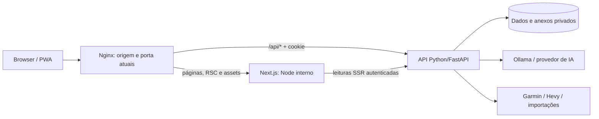

# Plano de migração da UI do AscentIQ

Data: 08/10/2026. Status: planejamento; implementação da nova stack ainda não iniciada.

Objetivo: substituir integralmente a interface React/Vite/CSS atual por React + Next.js App Router + TypeScript + Tailwind CSS + shadcn/ui, preservando as funcionalidades, os dados, as integrações e a composição visual aprovada.

Este documento é uma especificação de execução para outra IA ou desenvolvedor. A migração termina quando todos os fluxos ativos funcionam na nova interface e o frontend antigo pode ser retirado com segurança. Criar apenas um novo shell ou algumas páginas não conclui o trabalho.

## 1. Requisitos obrigatórios

1. Usar as versões estáveis mais recentes e compatíveis de React, React DOM, Next.js, Tailwind e shadcn na data de início da implementação. Conferir novamente o registro npm antes de instalar e registrar as versões efetivamente adotadas.
2. Usar Next.js **App Router** e TypeScript em modo estrito. A nova aplicação não será uma única página Vite embutida em Next.
3. Estilizar com Tailwind, tokens CSS e os componentes shadcn versionados no projeto.
4. **Não usar styled-components em nenhuma situação**, nem adicioná-lo como dependência direta ou transitiva. A UI do projeto também não deve adotar Emotion, styled-jsx ou outras soluções CSS-in-JS: proibir dependências diretas, imports e uso dessas soluções em telas, componentes, gráficos e exemplos copiados.
5. Preservar todas as funcionalidades atualmente acessíveis, incluindo fluxos em modais, configurações, importações, documentos, biblioteca alimentar, exportações e assistente.
6. Manter o backend Python/FastAPI como responsável pelos dados, cálculos, autenticação e chamadas de IA. Ollama continua utilizável sem serviço pago obrigatório.
7. Manter o logo atual, tema escuro limpo, topbar de largura total, usuário à direita e conteúdo/menu lateral boxed e centralizados. Sidebar com altura natural.
8. Manter Dashboard, Workouts, Nutrition e Sleep no menu. Saúde, Planejamento, Relatórios e Histórico e decisões continuam fora da navegação; seus dados e serviços são preservados.
9. Todas as listas exibem 10 registros por padrão e no máximo 15. Totais e gráficos usam o período completo, independentemente da página da lista.
10. Manter desktop, mobile, acesso pela rede local e funcionalidades de PWA. Registrar separadamente a pendência de HTTPS confiável na rede local.

As decisões visuais mais recentes do usuário prevalecem sobre descrições antigas dos documentos de referência.

## 2. Ponto de partida confirmado

| Camada | Implementação atual | Consequência |
|---|---|---|
| Frontend | React/React DOM 19.2.0, Vite 7.3.6, JavaScript/JSX | Substituir build, entrada, roteamento e componentes da UI |
| Estilos | CSS próprio em `dashboard/web/src/style.css` | Recriar tema em tokens/Tailwind; retirar a cascata de overrides antiga |
| Componentes | Modais, paginação, cards, gráficos SVG e ícones próprios | Migrar comportamentos para componentes reutilizáveis |
| API | Python/FastAPI, `dashboard/server.py` e `dashboard/personal_api.py` | Preservar endpoints e regras de negócio |
| Dados | PostgreSQL e suporte JSON nos módulos Python | Não exigir migração de banco para trocar UI |
| IA | Provedores configurados no backend, incluindo Ollama | O navegador continua chamando a API da plataforma |
| Autenticação | Cookie de sessão HttpOnly, SameSite strict | Preservar sessão e proxy na mesma origem |
| Atualizações | Polling de dashboard/jobs a cada 5 s; metas a cada 15 s | Preservar atualização sem apagar dados ou remontar a tela |
| Publicação | Build Vite estático servido por Nginx em Docker | Acrescentar runtime Node para Next e adaptar o gateway |
| PWA | Manifesto, service worker, ícones e oferta de instalação próprios | Migrar mantendo identidade e cache restrito a conteúdo público |

Não há SSE ou WebSocket implementados nos fluxos atuais de IA. A migração não depende de introduzir streaming de respostas nem de alterar o protocolo de análise.

Referências internas: [especificação funcional](../SPEC_PLATAFORMA_SAUDE_FITNESS.md), [simplificação](SPEC_SIMPLIFICACAO_PLATAFORMA.md) e [direção visual](PLANO_UI_STITCH.md). Considerar também os ajustes de 08/10/2026 presentes no código atual.

## 3. Stack de destino e política de versões

Snapshot consultado em 08/10/2026, tags `latest` do registro público npm:

| Tecnologia | Versão estável verificada | Uso |
|---|---|---|
| Next.js | **16.4.0** | App Router, layouts persistentes, rotas e runtime web |
| React e React DOM | **19.3.0** | Mesma versão para os dois pacotes |
| Tailwind CSS e `@tailwindcss/postcss` | **4.3.3** | Estilos utilitários e integração PostCSS |
| CLI `shadcn` | **4.21.4** | Instalação/manutenção de componentes no código do projeto |
| TypeScript | **7.0.2** | Tipagem estrita, após validar compatibilidade de toda a ferramenta de build/lint |
| Node.js | **24 LTS**, patch atualizado e fixado | Desenvolvimento, CI e container Next; a imagem atual já usa a família 24 |

Fontes das versões: [Next.js 16.4](https://nextjs.org/blog/next-16-4), [versões do React](https://react.dev/versions), [Tailwind 4.3](https://tailwindcss.com/blog/tailwindcss-v4-3), [npm Tailwind](https://registry.npmjs.org/tailwindcss/latest), [npm shadcn](https://registry.npmjs.org/shadcn/latest), [npm TypeScript](https://registry.npmjs.org/typescript/latest) e [ciclo do Node.js](https://nodejs.org/en/about/previous-releases).

shadcn/ui fornece código de componentes para o projeto; a versão da CLI não representa uma biblioteca monolítica de componentes instalada em runtime. Registrar a versão da CLI, a configuração `components.json` e as alterações dos componentes gerados.

Política:

- Revalidar `latest`, requisitos de Node, peer dependencies e avisos de segurança no início da execução. Preferir os patches estáveis mais recentes; não adotar beta, canary ou experimental como dependências declaradas da aplicação.
- Fixar versões resolvidas e versionar um `package-lock.json` por frontend durante a coexistência temporária; preservar o lockfile da UI ativa. Depois do corte, manter apenas o lockfile do frontend oficial. Usar npm, já adotado no projeto, e `npm ci` no build/CI.
- Usar a integração React oficialmente oferecida pelo App Router; não substituir internals que o Next inclui. A política acima se aplica aos pacotes declarados pelo projeto.
- Qualquer incompatibilidade deve ser resolvida e documentada antes do primeiro corte. Não mascarar incompatibilidade com `--force`, `--legacy-peer-deps` ou ignorando erros de TypeScript/build.
- Atualizações posteriores passam por PR, validação e lockfile; não resolver `latest` automaticamente a cada deploy.

Bibliotecas de apoio propostas:

| Biblioteca | Decisão e propósito |
|---|---|
| TanStack Query | Adotar para dados remotos, invalidação, polling controlado e concorrência |
| React Hook Form + Zod | Adotar para formulários, validação de entrada e erros associados aos campos |
| `@hookform/resolvers` | Integração dos schemas com formulários |
| Lucide React | Ícones de interface; preservar o SVG original do logo |
| `clsx`, `tailwind-merge`, `class-variance-authority` | Composição de classes/variantes conforme componentes gerados; sem CSS-in-JS |
| Recharts + shadcn Chart | Gráficos usuais de séries/volumes; validar precisão, lacunas e acessibilidade |
| Vitest + Testing Library | Testes de regras de apresentação e interações críticas |
| Playwright + axe-core | Fluxos integrados, regressões visuais e verificações de acessibilidade |
| ESLint + configuração Next + Prettier | Regras de React/Next/TypeScript e formatação consistente |

Não adicionar Redux, Zustand, TanStack Table, biblioteca de datas, monorepo/Turborepo ou um segundo cliente HTTP sem uma necessidade demonstrada. `fetch` e `Intl` atendem aos casos atuais. Testar compatibilidade das bibliotecas de apoio com a stack escolhida antes de fixá-las.

Referências: [defaults do TanStack Query](https://tanstack.com/query/latest/docs/framework/react/guides/important-defaults), [formulários shadcn com React Hook Form](https://ui.shadcn.com/docs/forms/react-hook-form) e [shadcn Chart](https://ui.shadcn.com/docs/components/chart). Estas escolhas são decisões propostas para o AscentIQ.

## 4. Arquitetura proposta



O gateway mantém a origem e a porta de acesso do aplicativo. O serviço Next e a API ficam na rede interna Docker. A API continua recebendo `/api/*` diretamente pelo gateway; não criar uma segunda implementação dos mesmos endpoints em Route Handlers.

### Server e Client Components

- Usar Server Components para páginas/layouts, validação inicial de sessão e leituras iniciais quando houver benefício. Manter uma camada `server-only` para chamadas internas autenticadas.
- Usar Client Components nas fronteiras que precisam de interação: formulários, filtros, modais, gráficos interativos, calendário, polling, assistente e instalação PWA.
- Não colocar `"use client"` na árvore inteira por conveniência. Também não fazer chamadas sensíveis direto do navegador para Ollama, Garmin ou banco.
- Manter o shell e os providers no layout autenticado persistente. O assistente, sua conversa e o rascunho não podem ser remontados a cada troca de rota.
- `window`, `document`, `navigator`, storage e medições de DOM pertencem a efeitos/handlers. Client Components também podem pré-renderizar: sua renderização inicial deve ser determinística.
- Não criar UUIDs, datas locais variáveis ou conteúdo diferente entre servidor/browser durante a renderização inicial. Usar IDs recebidos da API, `useId` para campos e geração de tokens nos eventos apropriados.
- Usar `loading.tsx`, `error.tsx` e limites de erro por área, mantendo a navegação utilizável quando uma seção falha.

### Rotas

| Rota | Área |
|---|---|
| `/` | Dashboard, mantendo a entrada atual da PWA |
| `/login` | Login e retorno à rota solicitada após autenticar |
| `/workouts` | Visão geral |
| `/workouts/running` | Corrida |
| `/workouts/strength` | Força |
| `/nutrition` | Alimentação |
| `/sleep` | Sono |

Datas, períodos, filtros e página da lista devem ter representação validada em search params quando for útil para recarregar, compartilhar e voltar/avançar. Não colocar dados médicos, rascunhos, senhas ou tokens na URL. Trocar filtros não deve causar recarga completa da aplicação.

Objetivos, check-in, análises, conta, dados e documentos continuam em modais. Não criar novos destinos no menu para recursos que foram removidos da navegação.

### Organização de código

Criar inicialmente `dashboard/web-next/` em paralelo. Após a migração completa, assumir o caminho oficial `dashboard/web/`, atualizar CI/Docker/documentação e retirar o frontend antigo. A coexistência é temporária.

```text
dashboard/web-next/
  src/
    app/
      layout.tsx
      globals.css
      (auth)/login/page.tsx
      (platform)/layout.tsx
      (platform)/page.tsx
      (platform)/workouts/{page.tsx,running/page.tsx,strength/page.tsx}
      (platform)/nutrition/page.tsx
      (platform)/sleep/page.tsx
      manifest.ts
    components/
      ui/                 componentes shadcn versionados
      shell/              topbar, sidebar, conta, navegação mobile
      shared/             cabeçalhos, métricas, estados, paginação
    features/
      dashboard/ workouts/ nutrition/ sleep/
      goals/ checkins/ analyses/ assistant/
      profile/ settings/ documents/ pwa/
    lib/
      api/                clientes browser/server, DTOs e erros
      queries/            chaves, hooks e invalidação
      validation/         schemas dos formulários/contratos críticos
      dates.ts            datas calendário, fuso e formatação
      utils.ts            cn() e funções pequenas compartilhadas
    providers/            sessão, QueryClient, overlays e assistente
  public/                 logo, ícones PWA, sw.js e offline público
  tests/                  fixtures sintéticas, componentes e E2E
  components.json
  next.config.ts
  package.json
  package-lock.json
  AGENTS.md
```

Pages coordenam a área; componentes de domínio não devem chamar endpoints arbitrários. Concentrar contratos e chaves de query para impedir diferenças entre Dashboard, Nutrition e Objetivos.

## 5. Sistema visual e componentes

### Composição preservada

- Topbar 100% da página, com logo original, status discreto e conta à direita.
- Dropdown de conta: Conta e perfil, Dados e fontes, Sair.
- Conjunto sidebar + conteúdo centralizado, `max-width` de referência 1440 px, margens externas responsivas e coluna principal com `min-width: 0`.
- Sidebar desktop com altura do próprio conteúdo e posicionamento sticky; nunca impor `100vh` ao menu.
- Navegação mobile recolhível, compacta, com foco/restauração corretos. Não usar um preset de Sidebar/Sheet que reintroduza menu de altura integral.
- Dashboard, Nutrition e Sleep têm título/subtítulo **dentro do primeiro box**: “Dashboard / Alimentação, treinos e recuperação”, “Nutrition / consumo e metas” e “Sleep / Período histórico”.
- Corrida e Força continuam sem os textos promocionais externos removidos. Espaçamento consistente entre tabs, filtros, objetivo esportivo, métricas e painéis.
- “Analisar treinos do dia” fica na barra de tabs, alinhado à direita, somente na Visão geral; reorganizar no mobile sem sair desse grupo.
- Assistente inferior esquerdo acompanha a margem do boxed e permite continuar usando o site.

### Estilos

Definir tokens semânticos de fundo, superfície, borda, texto, texto secundário, primary, destructive, aviso, gráfico, raios e espaçamento. Aplicar variáveis CSS ao tema shadcn/Tailwind em `globals.css`, usando a integração Tailwind v4, sem transportar o arquivo CSS legado integralmente.

Tailwind define layout e aparência dos componentes; `globals.css` contém imports, tokens, base, acessibilidade e animações compartilhadas necessárias. Valores calculados de gráficos/posicionamento usam propriedades CSS/SVG controladas. Não introduzir uma engine de estilos em runtime.

O guard de CI bloqueia styled-components na árvore de dependências e imports/uso direto de CSS-in-JS no código da UI. O próprio [Next 16.4 declara styled-jsx entre seus internals](https://registry.npmjs.org/next/latest); não tentar removê-lo com overrides, pois isso pode quebrar o framework. Esse detalhe não autoriza seu uso nos componentes do projeto e não cria qualquer exceção para styled-components.

Usar fonte local ou stack do sistema, números tabulares e formatadores pt-BR. A aplicação local não deve depender de fontes/scripts de CDN. Não criar uma troca de tema ou redesign de marca como parte desta migração.

Evitar classes Tailwind montadas por concatenação de valores vindos da API; manter classes enumeradas/variantes explícitas. `cn()` e variantes por componente centralizam composição sem repetir grandes strings por toda a aplicação.

Referências: [integração Tailwind/Next](https://tailwindcss.com/docs/installation/framework-guides/nextjs) e [tema shadcn](https://ui.shadcn.com/docs/theming).

### Substituições

| Atual | Nova composição |
|---|---|
| `Modal` | Dialog + AlertDialog de confirmação, com política dirty/busy do domínio |
| `InfoButton` e explicações | Button + Popover/Dialog; Tooltip apenas para informação breve |
| `PagedList` | Pagination + Select + wrapper compartilhado de 10/15 registros |
| `Panel`, `Card`, métricas | Card e componentes semânticos de painel/métrica |
| Dropdown do usuário | DropdownMenu + Avatar |
| Tabs de Workouts | Navegação com Links e aparência de tabs; ARIA apropriado ao comportamento real |
| Inputs/formulários | Field/Label, Input, Textarea, Select, Checkbox, Switch e erros de campo |
| Estados | Skeleton, Empty, Alert, Badge e feedback de operação |
| Tabelas | Table, paginação e rolagem interna; cards quando melhorar mobile |
| Gráficos SVG de séries | shadcn Chart/Recharts quando houver paridade; componente especializado quando necessário |
| Grade de frequência | React + Tailwind próprios, Popover ao toque e conteúdo compartilhado de tooltip |
| Assistente | Painel não modal persistente; não usar Dialog com bloqueio/focus trap |

Escolher uma base de primitives do shadcn no setup, preferencialmente Radix para os componentes tradicionais, após validar a versão corrente. Registrar em `components.json` e usar as APIs da base escolhida. Não misturar exemplos Radix/Base UI/React Aria sem adaptar sua composição.

## 6. Matriz de paridade funcional

| Área | Funcionalidades que precisam funcionar na nova UI | Código atual de referência |
|---|---|---|
| Sessão e shell | Login/logout, expiração, acesso direto e navegação, atualização discreta, logo, boxed, dropdown, mobile | `main.jsx`, `personalApi.jsx` |
| Dashboard | Data, kcal/proteína versus metas, treino consolidado, sono com data, objetivo, check-in, pendências/cobertura e informação sob ícone | `Health.jsx` / `Today` |
| Frequência | Ano, grade completa centralizada, 0–4 categorias, cinza sem registro e intensidade crescente, tooltip por hover/foco/toque com data e labels presentes | `Frequency.jsx`, `dashboard/frequency.py` |
| Check-in | Criar, editar e remover registro do dia, validação e confirmação de descarte | `Health.jsx`, `ui.jsx` |
| Análise geral do dia | Modal no Dashboard/Nutrition, horário/contexto, relato opcional, gerar/consultar, resposta curta, stale, prompt e auditoria sob demanda | `DayReview.jsx` |
| Workouts geral | Fitness/Fadiga/Forma e método, períodos completos, resumo semanal/modalidades, referências e atividades recentes | `main.jsx` / `Overview`, `Performance` |
| Corrida | Filtros/busca, distância/duração/subida reais, volume semanal, histórico/provas paginados, IEP/confiança e origem dos dados | `main.jsx` / `Running`, `ActivityTable` |
| Força | Consolidação Garmin+Hevy, sessões, volume/séries/duração/FC, gráficos por grupo, exercícios/séries paginados, aquecimento/trabalho | `main.jsx` / `Strength` |
| Análise de treinos | Botão na barra, modal, data, contexto, geração, fingerprint/stale, copiar prompt e importar resposta externa | `DailyAnalysis.jsx` |
| Nutrition | Data, kcal/macros e metas, grid de refeições, adicionar/editar/copiar/excluir, fotos, cobertura parcial/completa/jejum | `Nutrition.jsx`, `FoodDiary.jsx` |
| Estimativa alimentar | Salvar dispara IA automaticamente, sem segundo clique obrigatório e sem campo manual obrigatório de calorias; pendência/erro/retry, hipóteses e itens | `FoodDiary.jsx` |
| Biblioteca alimentar | Salvar referência/receita, usar, escalar porções, revisar e remover; paginação | `FoodDiary.jsx` |
| Sleep | Filtros 7/30/90/tudo e intervalo, médias/cobertura, duração e score distintos, lacunas, histórico paginado, demais medidas apenas quando presentes | `Sleep.jsx`, `sleepView.js`, `SleepContext.jsx` |
| Objetivos e plano | Modal, CRUD/estados/prioridade/alvos/datas, preservações, plano vigente, metas automáticas, orientação manual, aceitar/rejeitar propostas e evidências | `Goals.jsx` |
| Conta e perfil | Sexo/altura/peso/fuso/TDEE manual, preferências/restrições/modalidades, medidas CRUD/gráficos, referências de gasto e check-in | `Health.jsx`, `EnergyEditor` |
| Assistente | Painel não bloqueante, minimizar/fechar/reabrir, conversa/rascunho durante navegação, histórico paginado/retomada, contextos de dia/mês/objetivos/períodos/custom, copiar/importar | `Assistant.jsx`, shell em `main.jsx` |
| Contexto médico | Documentos/dados médicos só entram após seleção explícita; retirar consentimento impede reenvio pelos turnos anteriores | `Assistant.jsx`, `Documents.jsx` |
| Dados e fontes | Configurar/desconectar Garmin/Hevy/IA, status/freshness/erro, Ollama/cloud opcionais, sincronização e progresso | `Settings.jsx` |
| Importação e reconciliação | CSV/GPX/FIT, atividade manual, resultados, repetição idempotente, vincular/manter/desvincular e histórico paginado | `Settings.jsx` |
| Documentos | Upload, original autenticado, extração consentida por IA, rascunho editável, resultados paginados, confirmação para incorporar e remoção | `Documents.jsx` |
| Portabilidade | JSON/ZIP, anexos selecionados, imagens/documentos/importações opcionais, sem credenciais/sessões | `Settings.jsx` |
| PWA | Oferta de instalação, orientação iOS, instalado/adiado, identidade/ícones, offline público e cache sem dados pessoais | `InstallApp.jsx`, `public/sw.js` |

Todos os caminhos da última coluna são relativos a `dashboard/web/src`, exceto os indicados como backend/public. Não substituir recursos existentes por botões sem implementação, dados mockados no aplicativo real ou links “em breve”.

Os históricos e serviços das áreas ocultas continuam armazenados/operacionais, sem obrigação de recriar suas telas antigas. Uma rotina nova de UI não pode apagar arquivos, planos ou registros só porque não há mais um item de menu para eles.

## 7. Contratos, dados e atualização

### Cliente de API

- Preservar paths, payloads, IDs, `revision`, `save_token`, `fingerprint`, status e consentimentos. Documentar DTOs com TypeScript e validar contratos críticos com Zod; não duplicar cálculos Python no frontend.
- Manter `credentials: 'same-origin'`, `cache: 'no-store'` e `X-AscentIQ-Request: 1` nas escritas. Enviar arquivos nos formatos e limites atualmente aceitos: imagens alimentares JPG/PNG/WebP até 6 MB; documentos/importações até 12 MB, conforme validação backend. A importação também limita o campo de conteúdo recebido a 24 MiB; esse limite de payload não significa aceitar arquivo bruto de 24 MiB.
- Tratar 401 como sessão expirada; 409 como conflito com recarga e revisão pelo usuário; erros de validação nos campos; falhas operacionais com ação de recuperação.
- Preservar IDs/revisions e tokens de idempotência. Desabilitar envios concorrentes do mesmo formulário e não habilitar retry automático de mutações.
- IA com erro não apaga refeição salva. Uma nova tentativa não cria outra refeição nem troca silenciosamente a revisão editada.

### Query e estado

- QueryClient em memória por sessão/browser; se houver hidratação SSR, criar instância por requisição, nunca singleton global compartilhado entre usuários.
- Chaves incluem data, período, filtros e identificador do recurso. Cancelar requisições antigas e evitar que uma resposta de outra data substitua a data atual.
- Manter dados da **mesma seleção** durante refetch. Quando muda data/período, não apresentar dados anteriores como se fossem da nova seleção.
- Preservar polling inicial de 5/15 s apenas nos recursos necessários, com deduplicação, pausa quando apropriado e backoff em falhas. Não gerar análises de IA dentro do polling.
- Escritas invalidam recursos relacionados: refeição atualiza grid/totais/Dashboard/frequência e estado da análise; objetivo/medidas atualizam plano/metas; importação/sync atualizam treinos/sono/frequência/contexto.
- A atualização não remonta modal/formulário, não limpa o gráfico nem fecha tooltip. Mostrar carregamento completo somente na primeira leitura/seleção sem dados válidos.
- Não persistir dados médicos, queries, conversas ou rascunhos em localStorage/IndexedDB como nova funcionalidade. Logout/expiração limpam estado privado e impedem respostas atrasadas de repovoá-lo.
- Logout/401 também devem invalidar a navegação/cache de rotas do Next, desmontar o shell privado e revalidar restauração pelo botão Voltar/BFCache. Não confiar apenas na checagem inicial do layout persistente. Testar `pageshow`/restauração e garantir validação de sessão antes de reapresentar conteúdo privado; a API continua autorizando toda leitura/escrita.

### Semântica dos números

- Ausência, zero, subtotal, pendência e erro são estados diferentes. Falta de sono não significa zero horas; distância desconhecida não vira 10 km.
- Sono com score zero é valor válido. Não interpolar lacunas de dados como medições reais.
- O heatmap conta categorias distintas: sono, alimentação, corrida e força. Quatro refeições continuam valendo um ponto de alimentação.
- Consolidar força Garmin/Hevy sem duplicar sessões, inclusive no Dashboard e tooltip.
- Gráficos e agregados são calculados sobre todo o período; só a apresentação da lista é paginada.
- Usar a referência de fuso do perfil, com padrão `America/Sao_Paulo`. Separar datas calendário de timestamps e formatar números/datas com `Intl`.
- Preservar as respostas concisas da IA e o mecanismo de análise desatualizada quando o contexto muda. Uma conversa não altera automaticamente o plano nem registros.

## 8. Autenticação, privacidade e CSP

Não criar outro sistema de usuários/senhas nem transferir sessão para token em storage. A API continua sendo a autoridade de autenticação. Layout/guard Next melhora navegação, mas não substitui autorização em cada endpoint.

O proxy preserva Host público, Cookie e Set-Cookie. POST deve continuar atendendo à validação atual de Origin versus Host e ao header de requisição. Em desenvolvimento, preferir o mesmo gateway; um rewrite alternativo só é aceito depois de testar essa compatibilidade, sem relaxar a proteção backend.

Leituras SSR usam URL interna fixa em variável exclusiva do servidor, `server-only`, cookie da requisição e fetch sem cache. Nunca obter destino backend arbitrário da URL enviada pelo usuário. Host encaminhado deve vir de uma origem validada/gateway confiável. Segredos e credenciais não usam prefixo `NEXT_PUBLIC_`.

Plano de cache: desativar **Cache Components na configuração inicial**, ainda que o scaffolder o habilite por padrão. Renderizar conteúdo autenticado dinamicamente. Não usar ISR, `use cache`, export estático, cache compartilhado ou otimização pública de imagens para conteúdo pessoal. Assets públicos versionados podem usar cache normal; TanStack mantém dados privados somente em memória da sessão.

Fotos de refeições e documentos continuam em endpoints autenticados. Usar URLs autenticadas diretamente, ou imagem Next com otimização desabilitada, até existir uma política privada específica. Não transportar arquivos privados para `public/`.

A CSP atual do Nginx, `script-src 'self'`, precisa ser adaptada aos scripts de hidratação do Next. Implementar nonces por requisição e política compatível com renderização dinâmica, seguindo o guia oficial. Definir um responsável pela CSP das páginas e evitar dois headers conflitantes. Não liberar `unsafe-eval` em produção nem desativar a política para fazer o build funcionar. O ambiente dev pode exigir política própria, sem propagá-la ao deploy.

Não registrar payloads médicos, senhas, cookies ou chaves nos logs do Node/CI. HTML e respostas RSC autenticadas precisam de política privada sem cache no gateway; manter os headers de proteção existentes onde aplicáveis.

Referências: [autenticação Next](https://nextjs.org/docs/app/guides/authentication) e [CSP com Next](https://nextjs.org/docs/app/guides/content-security-policy). As restrições de dados acima refletem o contrato atual do AscentIQ.

## 9. Acessibilidade e interação

Usar semântica HTML, nomes acessíveis, labels de formulário e foco visível. Validar teclado, leitor de tela, contraste, alvos de toque e `prefers-reduced-motion`; os primitives shadcn não garantem sozinho a acessibilidade da composição final.

Modais preservam foco inicial, Tab/Shift+Tab, Escape seguro, retorno de foco e confirmação de descarte. Busy/dirty impedem fechamento que perderia trabalho. Erro de formulário permanece perto do campo; toast não é o único aviso de falha.

O assistente é não modal: não bloqueia scroll nem captura exclusivamente teclado/foco. Análises, objetivos, check-in e refeições continuam modais com comportamento de foco apropriado.

No calendário, teclado e toque acessam o mesmo resumo de hover, omitindo labels sem registros. Um Tooltip que só abre com mouse não atende ao requisito mobile. Gráficos têm resumo textual/unidades e não dependem exclusivamente de cor.

## 10. PWA e execução local

- Preservar `id`, scope e entrada `/`, nome, logo/ícones e display standalone, evitando criar outra instalação por mudança de identidade.
- Migrar o manifesto para a convenção Next ou manter o arquivo atual; ter uma única fonte de verdade.
- Registrar service worker em Client Component. Preservar oferta Android/navegadores compatíveis, orientação de instalação iOS, ocultação quando instalado e adiamento de sete dias.
- Cachear apenas recursos públicos explicitamente permitidos. Não cachear `/api`, páginas autenticadas, respostas RSC/Flight, fotos alimentares ou documentos. Revisar o cache antigo durante a troca de versão.
- Offline mostra página pública sem dados de saúde e não promete edição/sincronização offline.
- Usar assets/fontes locais, sem dependência de CDN em runtime.

**Pendência existente:** o IP de rede local atualmente é servido por HTTP. Next.js não transforma isso em contexto seguro. Incluir uma tarefa de configuração e validação de HTTPS confiável nos dispositivos usados; a forma de confiança/domínio/certificado precisa ser definida antes dessa tarefa. A troca de UI pode ser concluída sem declarar a instalação PWA mobile em LAN validada enquanto essa dependência persistir.

Referência: [guia PWA do Next](https://nextjs.org/docs/app/guides/progressive-web-apps). Manter a política de privacidade mais restrita já existente no service worker.

## 11. Skills e manutenção por IA

Skills são instruções para o agente desenvolvedor, não dependências que o navegador precisa para funcionar. Incluir esta preparação no trabalho de migração e registrar fonte/revisão; não instalar skills desconhecidas apenas pelo nome.

| Recurso | Ação planejada | Motivo |
|---|---|---|
| Skill oficial **shadcn** | Instalar se ausente, a partir da fonte indicada na documentação oficial; conferir `SKILL.md` e configuração do projeto | Encontrar/manter componentes, tema, CLI e APIs da base correta |
| **react-best-practices** da Vercel | Instalar se ausente, a partir de `vercel-labs/agent-skills` | Revisar fronteiras server/client, consultas, renderização e tamanho de bundle |
| **web-design-guidelines** da Vercel | Recomendada para a revisão final e manutenção; instalar se ausente | Verificação de acessibilidade, foco, formulários e UX |
| Documentação de agentes do **Next.js** | Ativar/preservar o `AGENTS.md` e a documentação vinculada à versão instalada | Usar convenções atuais do App Router em vez de instruções antigas |
| **skill-installer** | Já disponível nesta sessão; usar para instalações após validar origem/path/ref | Evitar instalação duplicada ou pacote incorreto |
| Skill de testes de navegador | Opcional se faltar uma capacidade de QA; a ferramenta de navegador já disponível e os testes Playwright do repo podem atender | Não instalar outra skill como requisito artificial |
| Skill própria do AscentIQ | Opcional somente se as instruções do repo não forem suficientes | Registrar invariantes do domínio e fluxo de manutenção, sem duplicar documentação |

**Atualização importante:** a antiga `next-best-practices` do repositório `vercel-labs/next-skills` deixou de ser uma skill separada. O projeto oficial direciona esse conhecimento às docs embarcadas e regras de agentes das versões recentes do Next. Não instalar cópia antiga por hábito. Skills de Cache Components também não são necessárias na configuração inicial proposta.

Fontes verificadas: [skills shadcn](https://ui.shadcn.com/docs/skills), [skills Vercel](https://github.com/vercel-labs/agent-skills), [mudança das skills Next](https://github.com/vercel-labs/next-skills) e [agentes no Next](https://nextjs.org/docs/app/guides/ai-agents).

Procedimento na etapa de preparação:

1. Conferir skills já instaladas e paths atuais dos repositórios oficiais; ler os arquivos antes de executar scripts.
2. Instalar apenas as ausentes e adequadas, usando skill-installer ou o fluxo oficial compatível com o agente. Fixar/registrar commit ou release de origem e não atualizar silenciosamente durante uma implementação.
3. Registrar comandos de setup, versões e localização no README de desenvolvimento. Conferir que serão descobertas na sessão usada para implementar.
4. Criar instruções duráveis do frontend em `AGENTS.md`: proibição de styled-components/CSS-in-JS, contrato API, layout, 10/15, dados ausentes, privacidade, comandos e critérios de validação.
5. Preservar as instruções/docs geradas pelo Next sem sobrescrever regras locais; nenhuma orientação de skill pode contrariar os requisitos do usuário.

Não há necessidade identificada de skill separada para Tailwind. A documentação oficial e a skill shadcn cobrem o setup proposto. Não instalar skills de hosting/Vercel, Sites ou serviços pagos para este aplicativo local Docker.

## 12. Etapas de execução e entregáveis

### Etapa 0 — Baseline e preparação

- Inventariar a versão realmente em uso, incluindo alterações recentes ainda não commitadas; preservar esses ajustes no ponto de partida.
- Criar branch/worktree adequado e snapshot recuperável da UI atual, sem copiar dados privados para o Git.
- Converter a matriz da seção 6 em checklist rastreável; mapear cada ação a endpoint e cenário de aceitação.
- Capturar referências desktop/mobile e amostras **sintéticas** dos contratos API, sem anexar registros pessoais a testes/PRs.
- Confirmar versões/compatibilidade e preparar skills/docs de agentes.

Entrega: baseline, matriz de paridade, política de dependências e plano de QA. Sem trocar o site ativo.

### Etapa 1 — Fundação Next e componentes

- Criar `web-next` com App Router, TypeScript strict, Tailwind v4, aliases, lint/formatação e lockfile.
- Configurar shadcn, base única, tokens, logo, componentes compartilhados e proibição automatizada de CSS-in-JS.
- Configurar QueryClient, cliente API tipado, datas e camada server-only.
- Preparar Docker/preview independente, ambiente sintético e healthchecks.

Uma porta de preview diferente não isola cookies do mesmo host. Usar perfil/contexto de browser isolado e API/dados sintéticos para QA de escrita; não misturar a sessão pessoal do site ativo com o preview de testes.

Entrega: build/lint/typecheck passam; componentes básicos e preview funcional, sem dados fictícios no ambiente pessoal.

### Etapa 2 — Sessão, shell e navegação

- Migrar login/expiração/logout, layout persistente, topbar, sidebar, mobile, dropdown e rotas.
- Validar cookies, Origin/Host, CSP/nonce e cache antes das telas de domínio.
- Implementar estados de erro/carregamento e infraestrutura de modais/rascunhos.

Entrega: navegação por URL e voltar/avançar corretos; desktop/mobile e sessão sem regressões.

### Etapa 3 — Dashboard e frequência

- Migrar resumo do dia, filtros, informação, frequência e check-in.
- Integrar as ações aos overlays compartilhados; completar seus fluxos nas etapas seguintes.
- Validar contagem por categorias, tooltip mobile, metas versus consumo e ausência/pendência.

Entrega: valores equivalentes à API e refresh sem piscar; botões não são considerados concluídos até seus fluxos estarem migrados.

### Etapa 4 — Nutrition e objetivos

- Migrar grid/paginação, formulário com foto, edição/cópia/exclusão, IA ao salvar e retry seguro.
- Migrar cobertura e biblioteca de receitas/referências.
- Migrar Objetivos/plano vigente/propostas/metas e análise geral do dia acessível nas duas telas.

Entrega: fluxo completo de registro e estimativa; metas iguais em Objetivos, Nutrition e Dashboard; conflitos e falhas preservam o registro.

### Etapa 5 — Sleep e Workouts

- Migrar Sleep, filtros, séries e histórico completo/paginado.
- Migrar Visão geral/Corrida/Força, gráficos, consolidação e detalhes.
- Migrar análise de treinos, prompt/resposta externa e posição do botão na barra.

Entrega: números e unidades equivalentes, lacunas reais, nenhuma distância fixa indevida e nenhuma contagem duplicada.

### Etapa 6 — Conta, dados, documentos e assistente

- Migrar perfil/preferências/medidas e referências metabólicas.
- Migrar integrações/configuração IA, sincronização/jobs, importações/reconciliação e exportações.
- Migrar documentos, extração/revisão/incorporação e consentimentos.
- Migrar assistente persistente, contextos, histórico/retomada e resposta externa.

Entrega: toda a matriz funcional operante, incluindo fluxos menos frequentes; nenhum serviço pago obrigatório.

### Etapa 7 — PWA, revisão e CI

- Migrar manifesto/SW/oferta de instalação e política de cache.
- Completar testes unitários/E2E, revisão visual/mobile/acessibilidade e comparação dos dados.
- Atualizar CI sem retirar a validação Python/PostgreSQL/instalação vazia existente.
- Medir desempenho e verificar que polling não destrói o estado da UI.
- Validar HTTPS/PWA quando a dependência de confiança nos dispositivos estiver resolvida; registrar qualquer limitação restante com precisão.

Entrega: evidências por funcionalidade e candidato de release completo, ainda com rollback disponível.

### Etapa 8 — Corte e limpeza

- Publicar a nova UI na origem/porta atual somente após a matriz e os checks exigidos passarem.
- Validar smoke tests com dados existentes em leitura; usar dados isolados para operações de teste que gravam.
- Assumir `dashboard/web`, retirar entrada/build/Vite/CSS legados e imports mortos da UI ativa; preservar serviços/dados das áreas ocultas.
- Atualizar Docker, Compose, README, instruções de agentes e referência da arquitetura.
- Manter imagem anterior recuperável durante a estabilização e testar o procedimento de rollback.

Entrega: aplicação inteira na nova stack, repositório consistente e checklist de conclusão preenchido.

## 13. Testes e critérios de aceitação

Os testes protegem comportamento e dados; não criar snapshots de cada classe Tailwind ou testes que apenas reproduzem a implementação.

### Automação

| Nível | Cobertura obrigatória |
|---|---|
| Qualidade | `npm ci`, ESLint, TypeScript strict, formatação, build Next e verificação de dependências/imports proibidos |
| Domínio/apresentação | Ausente/zero/pendente, fuso/datas, sono, heatmap 0–4, deduplicação, totais do período e paginação |
| Componentes | Modal dirty/busy, foco, validação, estado de erro, tooltip/toque e atualização sem perder formulário |
| E2E | Login/expiração/logout; rotas/direto/voltar; Nutrition/IA falha/retry/409; metas/objetivos/check-in; análises; Sleep/Workouts; dados/documentos/exportação; assistente/consentimento |
| Backend | Manter suíte Python e PostgreSQL, instalação vazia e checks atuais em `.github/workflows/platform.yml` |
| Deploy | Build da imagem, healthchecks, proxy/cookies/headers/CSP e rollback |

Usar backend/fixtures sintéticos e IA simulada para resultados determinísticos, incluindo casos de erro/timeout. Fazer smoke test real do provedor local em ambiente isolado quando necessário, sem expor dados médicos ou alterar o diário real para testar.

Testes unitários Vitest/Testing Library cobrem utilitários e Client Components. Usar Playwright para fluxos que envolvem Server Components/roteamento/auth, em vez de depender de mocks que escondem o runtime Next.

Referências: [Playwright best practices](https://playwright.dev/docs/best-practices) e [Vitest](https://vitest.dev/guide/).

### Cenários essenciais de regressão

1. Quatro refeições num dia sem outras categorias dão um ponto de frequência, com tooltip contendo o total alimentar.
2. Categoria sem registro não aparece no tooltip; hover/foco/toque funcionam.
3. Refeição pendente não vira zero kcal nem some após erro de IA; editar/retry não duplica.
4. Totais de Nutrition/Dashboard e metas do plano são consistentes depois de uma alteração.
5. Corrida mantém distância real variável; força Garmin+Hevy conta uma sessão consolidada.
6. Fadiga/fitness/forma preservam série e filtros; não substituir tudo por último valor ou linha constante.
7. Sleep respeita noites ausentes, score zero e período completo, mesmo na página 2.
8. Trocar a data durante uma requisição não recebe a resposta antiga na seleção nova.
9. Polling não pisca, não fecha tooltip, não reseta paginação indevidamente e não apaga rascunho.
10. Modais protegem alterações não salvas e restauram foco; assistente permite navegar sem perder conversa.
11. Seleção médica revogada deixa de entrar no contexto, inclusive em continuidade de conversa.
12. Logout/401 limpam estado privado; navegador/Cache Storage não revelam dados por cache após sair.
13. Imports/exportações/documentos respeitam consentimento, limites e formato; export não inclui credenciais.
14. PWA conserva identidade e offline público; instalação LAN só é declarada validada após teste em HTTPS confiável.

### Revisão visual e desempenho

Verificar pelo menos 360/390 px, tablet, desktop comum e monitor largo. Sem scroll horizontal global; tabelas/heatmap podem ter rolagem interna. Comparar topbar total, boxed, menu natural, cabeçalhos internos e espaçamentos aprovados.

Registrar baseline e resultado de carregamento, volume de requests e bundles das rotas. Carregar gráficos, documentos e análises pesadas sob demanda; não enviar todas as features no primeiro bundle. Evitar waterfalls de consultas independentes e múltiplos pollings do mesmo recurso.

Critérios: console sem erros de hidratação/React, nenhum bloqueio de uso por refetch, nenhuma chamada de IA gerada automaticamente por renderização, nenhum dado privado servido por cache compartilhado e nenhum erro grave de acessibilidade pendente. Não adotar recursos experimentais para atingir um score de benchmark.

## 14. Docker, publicação e rollback

Usar Next standalone em container Node 24 LTS, multi-stage e usuário sem privilégios. Copiar output standalone, assets estáticos e `public` necessários. Não rodar `next dev` em produção.

Adaptar `dashboard/Dockerfile.web`, `dashboard/nginx.conf`, `compose.yaml` e workflow. Gateway encaminha páginas/assets ao Node e `/api/*` à API. Preservar host público, timeouts atuais de IA e buffering adequado; streaming do Next também deve ser considerado pelo proxy, mesmo sem streaming de IA.

Preservar o contrato de upload atual: payload JSON com texto para CSV/GPX e base64 para FIT, documentos e imagens. Configurar limite de corpo do gateway pelo tamanho transmitido, considerando a expansão base64 e o envelope JSON, além dos limites de arquivos aplicados no backend. Validar imagens, documentos e importações grandes sem trocar o contrato para multipart durante a migração. Referências do contrato: `dashboard/imports.py`, `dashboard/personal_api.py`, `Settings.jsx`, `Documents.jsx` e `FoodDiary.jsx`. Não expor Node/API diretamente à rede local como consequência acidental da migração. Preservar a publicação atual do aplicativo e usar porta de preview apenas para validação controlada.

Referência: [self-hosting do Next](https://nextjs.org/docs/app/guides/self-hosting). A arquitetura Docker local continua sendo a escolha do projeto; não há requisito de Vercel/cloud.

Rollback consiste em restabelecer a imagem/configuração de gateway da UI anterior, preservando API, dados e volumes. Como o plano não muda schema nem cálculos, o retorno não deve exigir restaurar banco. Verificar também a compatibilidade do service worker e assets antigos durante corte/retorno.

## 15. Definição de conclusão

- [ ] Versões estáveis rechecadas, compatíveis e fixadas em lockfile.
- [ ] Next App Router + React + TypeScript + Tailwind + shadcn formam toda a UI ativa.
- [ ] Nenhum uso/dependência de styled-components; nenhum import/uso ou dependência direta de Emotion, styled-jsx ou outra engine CSS-in-JS na UI; CI aplica essas regras sem alterar internals obrigatórios do Next.
- [ ] Todos os itens da matriz funcional passaram, incluindo dados, documentos, biblioteca e assistente.
- [ ] Layout recente preservado: topbar total, boxed, sidebar natural, conta à direita e títulos internos.
- [ ] Listas limitadas a 10/15; gráficos/totais continuam cobrindo o período inteiro.
- [ ] Login/sessão/Origin/Host, CSP, privacidade e imagens autenticadas verificados.
- [ ] Atualizações sem flicker, sem duplicação e sem perda de rascunhos.
- [ ] IA automática nas refeições, metas/contextos e respostas concisas preservados.
- [ ] PWA migrada e cache privado proibido; status da dependência HTTPS documentado honestamente.
- [ ] QA desktop/mobile/teclado e testes relevantes passaram.
- [ ] Backend/CI atual preservado e runtime Docker novo validado.
- [ ] Skills úteis preparadas, docs vinculadas à versão e instruções de manutenção registradas.
- [ ] Vite e CSS legado retirados da aplicação ativa após a paridade completa.
- [ ] Publicação na origem atual e rollback verificados; nenhum dado pessoal entrou no Git.

Durante a implementação, resolver decisões rotineiras dentro dos requisitos definidos. Não ampliar o escopo para novos cálculos, novos serviços pagos ou funcionalidades de produto durante a troca de stack. Este documento registra o planejamento solicitado; sua criação não inicia a migração nem a instalação de skills.
